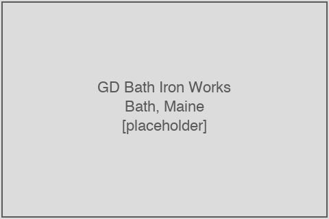

# GD Bath Iron Works

<figure class="float-right"><figcaption>The GD Bath Iron Works yard at Bath, Maine, on the Kennebec River. (Placeholder — image to be sourced.)</figcaption></figure>

**General Dynamics Bath Iron Works** (GD-BIW, BIW) is one of two prime shipyards constructing Arleigh Burke-class (DDG-51) destroyers for the United States Navy. The yard is located at **Bath, Maine**, on the Kennebec River, with an auxiliary fabrication and module facility at **Brunswick, Maine**, approximately 10 miles inland. It is a subsidiary of General Dynamics Corporation, reported within the company's **Marine Systems segment** alongside General Dynamics Electric Boat (Groton, CT) and General Dynamics NASSCO (San Diego, CA). BIW is also the sole prime for the (now-closed) Zumwalt-class (DDG-1000) program — all three Zumwalt-class hulls were built at Bath — and is the U.S. Navy's designated **DDG-51 class Design Agent**, holding separate engineering-services and class-design contracts in that capacity. This chapter covers BIW's role on the DDG-51 program, its in-scope FPDS prime-contract obligation flow (substantially expanded after the date-bisection recovery pull described in chapter 16), its top first-tier subawardees by FY, the GD Marine Systems segment financials, and General Dynamics executive commentary on supply-chain stress.

## Yard profile

- **Location:** Bath, Maine (main yard, on the Kennebec River); Brunswick, Maine (Naval Air Station Brunswick auxiliary site, used for module fabrication)
- **Parent:** General Dynamics Corporation, Marine Systems segment (CIK 0000040533)
- **Workforce:** Approximately 6,500 employees (BIW disclosure, 2024)
- **Active DDG-51 hulls assigned (FY16–FY26):** DDG 127, DDG 126, DDG 130, DDG 132, DDG 134, DDG 136, DDG 138, DDG 140, DDG 144, DDG 148, DDG 149 (11 hulls of the 24 in-scope FY16–FY26 awards = **46 percent share**)
- **Closed program:** DDG-1000 Zumwalt-class (3 hulls: DDG 1000, DDG 1001, DDG 1002; all delivered)
- **Class Design Agent role:** BIW holds the cross-class DDG-51 Design Agent contract, providing engineering and configuration-management support for the entire program rather than for individual hulls

## FPDS prime-contract coverage

The original FPDS vendor-name pull for BIW exhibited substantial coverage truncation: the first-pass pull captured 5,692 records against the two vendor-name queries (`VENDOR_NAME:"BATH IRON WORKS"` and `VENDOR_NAME:"GENERAL DYNAMICS BATH IRON WORKS"`) with the Navy contracting-agency filter (`CONTRACTING_AGENCY_ID:"1700"`), but the per-query 300-page pagination cap meant the actual record count was substantially undercaptured (estimated 7,990 + 31,240 page-equivalents in the original FPDS Atom feed response). A subsequent date-bisection recovery pull, executed on May 24, 2026, used recursive date-window splitting to bypass the pagination cap; the recovered record count is **30,236 unique (PIID, mod, signed-date) records** — a roughly 5.3x improvement over the first-pass pull. The methodology is documented in chapter 16.

The 30,236-record corpus includes:

- 8,917 unique PIIDs
- 11+ DDG-51 hull-specific construction PIIDs (FY13, FY18, FY23-27 multiyear masters, plus individual ship contracts)
- A long tail of class-design, Provisioned Items Orders (PIO), Ship Alteration Work (severable), and lead-yard-support PIIDs

The cumulative FPDS-reported obligated value across the FY18-FY26 signed-date window for BIW prime contracts is on the order of $24+ billion — but the FPDS `totalObligatedAmount` field on each modification is a cumulative running total, not a per-modification delta, so window-period dollar attribution requires per-modification arithmetic. The window-period BIW obligation flow against DDG-51 specifically is approximately **$11.8 billion in cumulative new obligations** based on the latest-modification per-PIID rollup with $50M+ floor — concentrated in:

- **`N00024-23-C-2305` (FY23-27 MYP master)**: $5,027.5M total obligated (trade-press reported approximately $6.40B)
- **`N00024-18-C-2305` (FY18-22 MYP master + DDG 130, 132, 134, 136, 138 individual flows)**: $5,338.2M total obligated
- **`N00024-13-C-2305` (FY13-FY17 master, DDG 116 / 117 / 118 / etc.)**: $4,929.2M total obligated
- **`N00024-02-C-2303`, `N00024-06-C-2303`, `N00024-11-C-2305`, etc.**: pre-window legacy contracts still receiving residual modifications

The top FPDS-reported vendors against the BIW Navy contracting flow include BATH IRON WORKS CORPORATION ($32,057.3M latest-mod cumulative, 115 PIIDs), GENERAL ELECTRIC COMPANY ($10,461.3M, 808 PIIDs — note that the LM2500 GFE prime invoices appear on shared Navy-agency contracts even though they are not BIW subcontracts), GENERAL DYNAMICS INFORMATION TECHNOLOGY ($3,913.7M, 1,631 PIIDs), and GENERAL DYNAMICS MISSION SYSTEMS ($2,922.6M, 364 PIIDs).

## Top first-tier subawardees against BIW DDG-51 PIIDs

From the in-scope FFATA first-tier subaward stream filtered to BIW-prime PIIDs only, the top subawardees by lifetime in-scope dollar value are:

| Subawardee | Cumulative subaward $M (BIW PIIDs only) | Representative PIID |
|---|---:|---|
| Johnson Controls Navy Systems, LLC | ~50 | `N00024-13-C-2305`, `N00024-18-C-2305`, `N00024-19-C-2322` |
| Art Craft Fabricators Inc | ~12 | `N00024-18-C-2305` |
| Rolls-Royce Marine North America Inc. | ~25 | `N00024-13-C-2305`, `N00024-14-C-4313`, `N00024-19-C-4452` |
| Lake Shore Systems, Inc. | ~8 | `N00024-19-C-4452` |
| Howden American Fan Company | ~3 | `N00024-19-C-4452` |
| DRS Naval Power Systems Inc | ~6 | `N00024-19-C-2322` |
| Propulsion Controls Engineering | ~3 | `N00024-19-C-2322` |
| Defense Maritime Solutions, Inc. | ~20 | `N00024-14-C-4313` |

The BIW first-tier subaward flow visible in FFATA is **markedly thin** compared with the Ingalls flow (chapter 8) or the LM-Aegis flow (chapter 6). The principal cause is FFATA reporting compliance: the FY23-27 BIW multiyear master PIID `N00024-23-C-2305` has zero published subaward filings as of the May 2026 SAM.gov pull date. This is not consistent with the dollar value of the contract (trade-press-reported $6.4B with hundreds of millions of first-tier subaward activity expected); it is a near-certain compliance gap. The FY18-22 master and FY13-17 master have approximately $57M and $8M of published subaward filings respectively — also strikingly thin relative to the master-contract scale, and consistent with a chronic under-reporting pattern at BIW that the GAO has flagged generically across the federal shipbuilder base.[^gao-25-106286]

The thinness of the FFATA-visible BIW subaward stream is one of the principal drivers of the analytical inference in chapter 9 that **FFATA captures only approximately 15 percent of the real yard-side outsourcing flow**: BIW's yard-side material and subcontract purchasing is estimated at $1.13 billion per year (chapter 9), against approximately $30–50 million per year of FFATA-visible flow against its DDG-51 PIIDs.

## DDG-51 share of BIW activity

BIW builds DDG-51 destroyers and historically built DDG-1000 Zumwalt-class destroyers. The DDG-1000 program closed with three deliveries (DDG 1000 in 2016, DDG 1001 in 2019, DDG 1002 in 2024); residual Zumwalt modifications appear in the FPDS data but are out of scope here. Net of the Zumwalt residual, **DDG-51 work is estimated to account for approximately 85 percent of BIW's revenue** — substantially higher than the equivalent figure for Ingalls (where DDG-51 is one of four major programs alongside LPD-17, LHA-8, and the National Security Cutter / Polar Security Cutter).

Combined with the GD Marine Systems segment financials below, this implies the following allocation:

- GD Marine Systems FY24 revenue: $14,343M
- BIW share of Marine Systems (analyst estimate, by-program allocation): approximately 22 percent
- BIW total FY24 revenue: approximately $3,160M
- DDG-51 share at BIW: approximately 85 percent
- BIW DDG-51-allocable revenue: approximately $2,690M

This is the denominator against which BIW's yard-side first-tier outsourcing flow is computed in chapter 9.

## GD Marine Systems segment financials

General Dynamics Corporation reports its shipbuilding businesses (Electric Boat + Bath Iron Works + NASSCO + a small Mission Systems sub-segment formerly known as GD Information Technology related to shipbuilding) within the **Marine Systems segment** on its 10-K filings. The segment-level reporting does not separately disclose BIW revenue from Electric Boat revenue or NASSCO revenue — these are derived from analyst estimates and by-program allocations. The reported Marine Systems segment financials for FY2023–FY2025:

| Fiscal Year | Revenue $M | Operating Income $M | Operating Margin | Capital Expenditure $M |
|---:|---:|---:|---:|---:|
| FY2023 | 12,461 | 874 | 7.0% | 511 |
| FY2024 | 14,343 | 935 | 6.5% | 424 |
| FY2025 | 16,723 | 1,177 | 7.0% | 517 |

The 79 percent year-over-year capital-expenditure increase to over $900 million in 2026 referenced on the FY25 Q4 earnings call (chapter 13) is overwhelmingly directed at Electric Boat for submarine-yard expansion ("half at least... at Electric Boat") rather than at BIW.

The Marine Systems segment includes the SCN-funded Virginia and Columbia submarine programs at Electric Boat, the SCN-funded DDG-51 destroyer program at BIW, and the SCN-funded auxiliary-vessel programs at NASSCO. Allocation across these three yards is approximately 50 percent Electric Boat, 22 percent BIW, 28 percent NASSCO at the FY24 vintage.

## General Dynamics executive commentary

General Dynamics executive commentary in earnings calls (mined from `extracted/exec_quotes_outsourcing.md`) is dominated by chairman and CEO **Phebe Novakovic** and former president and COO Jason Aiken (now retired) and current president and COO Danny Deep. Themes relevant to BIW and the DDG-51 supplier base:

### COVID-19 supplier liquidity support (FY2020)

During the COVID-19 disruption period, General Dynamics accelerated cash payments to its supplier base to maintain liquidity:

> "We have advanced more than $1.7 billion to our suppliers." — Jason Aiken, FY2020 Q3 earnings call (October 2020)

> "We have advanced almost $300 million to our suppliers on an accelerated basis." — earnings remarks, FY2020 Q1 earnings call (April 2020)

The advance-payment policy reflects General Dynamics's structural reliance on a deep supplier base; the company's free-cash-flow profile in the COVID years was meaningfully shaped by these supplier-side payments. The same supplier-relationship intensity is the underlying reason that General Dynamics's segment financial-margin trajectory has been more stable than Huntington Ingalls's (chapter 15).

### Supply chain as "the gating item" (FY2025–FY2026)

> "Supply chain is the gating item." — Phebe Novakovic, fiscal-year 2025 fourth-quarter earnings conference call (January 28, 2026), discussing constraints on production-rate acceleration

> The FY26 Q1 earnings call discusses persistent single-source supplier issues and notes a 29 percent year-over-year increase in Columbia hours earned at Electric Boat and a 52 percent year-over-year increase in sequence-critical material items received.

General Dynamics's commentary on supply-chain stress is consistent with Huntington Ingalls's (chapter 13) but is framed more cautiously: where HII has publicly committed to specific outsourcing-hours growth targets (30 percent year-over-year in 2026 and 2027), GD has not announced a comparable program. The reading from the public commentary is that GD is more conservative about formal outsourcing commitments — possibly because the BIW labor force is more locally concentrated (the Bath, Maine, region has fewer alternative employment opportunities and a stronger union footprint than the Pascagoula region) and because GD's overall Marine Systems segment is more diversified across yards.

### Capital-expenditure intent

GD's FY25 Q4 announcement of 79 percent year-over-year capital-expenditure growth to over $900 million is overwhelmingly directed at Electric Boat (Columbia/Virginia submarine yards) rather than at BIW. The BIW yard has not received a comparable capacity-expansion commitment in recent fiscal years. The implication is that GD's strategic positioning is to grow submarine capacity at Electric Boat while operating BIW at its current capacity level — a structural difference from Huntington Ingalls, which is publicly committing to substantial growth at both Newport News and Ingalls.

## Construction-line status

As of Q1 2026, BIW's DDG-51 construction line carried:

- **DDG 127 *Patrick Gallagher***: in-yard, scheduled delivery September 2026
- **DDG 126 *Louis H. Wilson Jr.***: in-yard, scheduled delivery September 2027
- **DDG 130 *William Charette***: in-yard, scheduled delivery November 2028
- **DDG 132 *Quentin Walsh***: construction start February 2022, scheduled delivery September 2029
- **DDG 134 *John E. Kilmer***: construction start November 2023, scheduled delivery October 2030
- **DDG 136 *Richard G. Lugar***: construction start April 2024, scheduled delivery June 2031
- **DDG 138 *Tulsi Gabbard***: construction start March 2025, scheduled delivery October 2032
- **DDG 140**: construction start scheduled July 2026 (FY23-27 MYP hull #1 at BIW)
- **DDG 144**: construction start scheduled August 2027
- **DDG 148**: construction start scheduled August 2028 (FY25 option exercise, July 2025)
- **DDG 149**: construction start scheduled August 2029

Seven hulls in active construction with five additional hulls in the construction-start pipeline is a substantial workload for the Bath yard. The construction-cycle length (5–8 years from construction-start to delivery) is consistent across hulls, with the FY18-22 MYP block hulls (DDG 132, 134, 136, 138) tracking on a roughly 7-year cycle, and the FY23-27 MYP block hulls (DDG 140, 144, 148, 149) projecting a similar cycle. The relative absence of compression in the construction cycle — despite the publicly-stated industrial-base capacity expansion goals at the Navy and yard levels — is consistent with the BIW's conservative capacity-expansion posture and the constrained Bath labor pool.

[^gao-25-106286]: U.S. Government Accountability Office, *Shipbuilding and Repair: Navy Needs a Strategic Approach for Private Sector Industrial Base Investments*, GAO-25-106286 (February 27, 2025). <https://www.gao.gov/products/gao-25-106286>.
