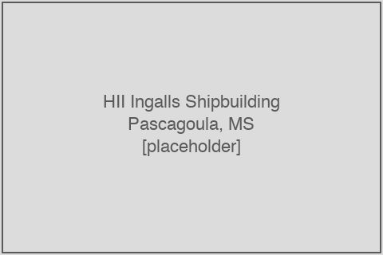

# HII Ingalls Shipbuilding

<figure class="float-right"><figcaption>HII Ingalls Shipbuilding at Pascagoula, Mississippi, on the Pascagoula River. (Placeholder — image to be sourced.)</figcaption></figure>

**Huntington Ingalls Industries Ingalls Shipbuilding** (HII-Ingalls, Ingalls Shipbuilding) is the second of two prime shipyards constructing Arleigh Burke-class (DDG-51) destroyers for the United States Navy. The yard is located at **Pascagoula, Mississippi**, on the Pascagoula River and the Gulf of Mexico. It is a subsidiary of Huntington Ingalls Industries, Inc., reported within the company's **Shipbuilding segment** as a distinct sub-segment called Ingalls Shipbuilding alongside the larger Newport News Shipbuilding sub-segment (which builds aircraft carriers and Virginia/Columbia submarine modules). Ingalls Shipbuilding is also the prime for three other major Navy and Coast Guard programs running concurrently with DDG-51 at the same Pascagoula facility: the LPD-17 San Antonio-class amphibious transport dock, the LHA-8 America-class amphibious assault ship, the National Security Cutter (Legend-class) for the U.S. Coast Guard, and the Polar Security Cutter for the U.S. Coast Guard. This chapter covers Ingalls's role on the DDG-51 program, its **distributed-shipbuilding strategy** (which is the single most publicly-developed make-or-buy framework articulated by either destroyer prime), its FY23-27 multiyear master contract, its W International acquisition, its HII Ingalls segment financials, and the DDG-share triangulation underlying the chapter 9 yard-side outsourcing estimate.

## Yard profile

- **Location:** Pascagoula, Mississippi (Pascagoula River, Gulf Coast)
- **Parent:** Huntington Ingalls Industries, Inc. (CIK 0001501585), Ingalls Shipbuilding sub-segment of the Shipbuilding segment
- **Workforce:** Approximately 11,500 employees (Ingalls disclosure, 2024–2025); HII total workforce ~44,000; Ingalls represents approximately 28 percent of HII headcount
- **Active DDG-51 hulls assigned (FY16–FY26):** DDG 129, DDG 131, DDG 133, DDG 135, DDG 137, DDG 139, DDG 141, DDG 142, DDG 143, DDG 145, DDG 146, DDG 147, DDG 150 (13 hulls of the 24 in-scope FY16–FY26 awards = **54 percent share**, with the post-FY23 Ingalls allocation running heavier than the historical alternating pattern)
- **Concurrent programs at the same facility:** LPD-17 San Antonio class, LHA-8 America class, U.S. Coast Guard National Security Cutter, U.S. Coast Guard Polar Security Cutter
- **Recent acquisitions:** W International (in-yard module-prefabrication capacity, acquired 2024)

## The FY23-27 multiyear master and recent deliveries

Ingalls Shipbuilding's role under the FY23-27 multiyear master award (PIID `N00024-23-C-2307`, awarded August 11, 2023, war.gov article 3491276) covers 7 DDG-51 hulls — DDG 141, 142, 143, 145, 146, 147, 150 — out of the 10 hulls in the combined two-yard FY23-27 block. The award is trade-press-reported at approximately $8.18 billion (vs. BIW's approximately $6.40 billion share); the actual obligated value is source-selection redacted in the DoD-announcement bulletin under 41 U.S. Code 2101 and FAR 3.104 (see chapter 12).

The corresponding SAM.gov first-tier subaward filings against `N00024-23-C-2307` total approximately $1.14 billion across 493 published subawards as of the May 2026 pull — a substantial visible-FFATA flow that contrasts sharply with the near-zero filings on BIW's parallel `N00024-23-C-2305`. Top subawardees include:

- General Electric Company — $266.7M (likely LM2500 GFE pass-through)
- Timken Gears & Services Inc. — $168.9M (main reduction gears)
- Johnson Controls Navy Systems, LLC — $129.3M (HVAC and environmental systems)
- Leonardo S.p.A. — $61.8M (via DRS subsidiary, combat-system content)
- Rolls-Royce Holdings plc — $49.5M

Recent deliveries from Ingalls include DDG 129 *Jeremiah Denton* (delivered August 2027 scheduled — note: 2025-2026 article cite an earlier delivery indicator, suggesting some name-vs-hull-number sequencing discrepancy worth verifying), and the in-process deliveries of DDG 133 *Sam Nunn* and DDG 135 *Thad Cochran* discussed in HII's Q1 2026 earnings remarks. Per the Q1 2026 transcript, Ingalls "achieved stern release on DDG 133 *Sam Nunn*. We also loaded main machinery on DDG 135 *Thad Cochran* and received the first 2 of 32 units in yard from our distributed shipbuilding partners on DDG 137 *John F. Lehman*."

## The distributed-shipbuilding strategy

The single most quantitatively-developed make-or-buy framework articulated by either destroyer prime is HII's **distributed-shipbuilding strategy**, publicly described across the company's FY24 Q3 through FY26 Q1 earnings calls. The strategy is more than a generic outsourcing intent; it is a formally-named operational initiative with specific public quantitative targets:

> "As an example, we are outsourcing over 1 million hours in 2024 and plan to increase that by over 30% in 2025." — HII FY24 Q3 earnings call (November 2024)

> "Outsourcing -- Doubled year over year in fiscal 2025 and planned to increase by 30% in fiscal 2026 to drive distributed shipbuilding." — HII FY25 Q4 earnings release (January 2026)

> "We've established over 23 vendors last year, and there's more to follow going forward... we're gonna increase we've increased outsourcing by 100% last year. We have a 30% targeted this year." — HII FY25 Q4 earnings transcript (January 2026)

> "Leveraging our distributed shipbuilding strategy, we are on track to grow our outsourcing hours year-over-year by 30%, and we will continue to identify capacity expansion opportunities to meet customer program demand requirements." — Chris Kastner, HII CEO, FY26 Q1 earnings call (May 2026)

> "Newport News Shipbuilding's Charleston operations contributed nearly '0.5 million earned hours of progress' in its first year, with plans to double throughput in 2026." — Kari Wilkinson, HII Newport News Shipbuilding president, FY26 Q1 (May 2026) — note that Charleston operations are a Newport News initiative (carrier and submarine work) rather than an Ingalls initiative, but the same distributed-shipbuilding framework is being applied at both Ingalls and Newport News

The quantitative trajectory implied by the cumulative guidance: 2024 baseline of approximately 1 million outsourcing hours → 35 percent increase in 2025 (per the FY25 Q1 earnings discussion) → 2024–2025 cumulative roughly doubled per the FY25 Q4 disclosure → additional 30 percent increase in 2026 → additional 30 percent in 2027 per FY26 Q1 medium-term guidance.

If the 2024 baseline of "over 1 million hours" represented approximately 10 percent of total Ingalls + Newport News shipbuilding hours (a rough order-of-magnitude inference from HII's total headcount and the implied annual hours per worker), then a 4-year cumulative trajectory of 100% + 30% + 30% would scale that to approximately 22–28 percent of total shipbuilding hours by 2027. This is consistent with the U.S. Navy's broader distributed-shipbuilding target of expanding the share of work performed at distributed sites from approximately 10 percent today to approximately 50 percent in the future (discussed in chapter 14), though the time horizon for the Navy target is longer.

The "23 vendors established last year" disclosure on the FY25 Q4 call is a notable quantitative anchor: 23 new distributed-shipbuilding partners onboarded in 2025 alone, with "more to follow" in 2026.

## The W International acquisition

In 2024, HII acquired **W International**, a South Carolina–based ship module fabrication firm. The acquisition is discussed in Chris Kastner's response to a Wolfe Research analyst question on the FY24 Q4 earnings call:

> "I really don't want to vertically integrate."

The Kastner statement is significant in context: the W International acquisition is *not* presented as a vertical-integration move (despite its in-yard-module-fabrication nature), but rather as the addition of "capacity" to the distributed-shipbuilding network. Kastner explicitly distances HII from a vertical-integration strategy, preferring instead to expand the network of distributed partners while operationally integrating selected high-volume capacity through ownership.

This is a structurally meaningful articulation: HII has positioned its outsourcing strategy as a **horizontal expansion of supplier capacity** rather than as a **vertical absorption of internal capacity**. The W International acquisition is treated as the exception that proves the rule. The broader implication for the supplier base is that HII expects its first-tier supplier count and the dollar volume of first-tier subaward filings to grow substantially over the FY26–FY28 horizon as the 23+ new distributed-shipbuilding partners (plus their successors) increase their share of HII work.

## Charleston operations

HII Newport News Shipbuilding opened **Charleston operations** in 2025 as a distributed-shipbuilding site for sub-assembly and module work that does not need to be performed inside the Newport News yard. The Charleston site is geographically distant from both Newport News and Pascagoula, and serves the Newport News carrier and submarine programs rather than the Ingalls destroyer program. However, the Charleston initiative is described by HII as a template for distributed-shipbuilding initiatives that the Ingalls side of the company is expected to replicate, possibly through a similar in-region distributed site near the Pascagoula yard.

> "Charleston is doing well... from a Hyundai standpoint, we still have — we're still engaging in discussions with them and evaluating potential. We don't see them in the network right now for this year." — Kastner, FY26 Q1 (May 2026)

The Kastner reference to "Hyundai" in the Q1 2026 transcript is notable: it acknowledges that HII has been in discussions with Hyundai Heavy Industries (the South Korean shipbuilder) about a potential distributed-shipbuilding partnership, while explicitly stating that Hyundai is not in the FY26 distributed-shipbuilding network. The discussion provides "upside if we're able to jointly invest in some operating manufacturing footprint." This is one of the very few public references in the destroyer supplier-base discussion to foreign-shipbuilder partnership; whether it materializes will be a key trajectory variable in the FY27–FY29 horizon.

## HII Ingalls Shipbuilding segment financials

Huntington Ingalls Industries reports the Ingalls Shipbuilding sub-segment financials within the company's larger Shipbuilding segment 10-K disclosures. The Ingalls sub-segment revenue, operating income, and operating margin from the recent vintages:

| Fiscal Year | Ingalls Revenue $M | Ingalls Operating Income $M | Operating Margin |
|---:|---:|---:|---:|
| FY2019 | 2,555 | (analyst est.) ~250 | ~9.8% |
| FY2020 | 2,678 | ~265 | ~9.9% |
| FY2021 | 2,528 | ~250 | ~9.9% |
| FY2022 | 2,570 | ~200 | ~7.8% (margin compression begins) |
| FY2023 | 2,752 | ~365 | ~13.2% |
| FY2024 | 2,767 | ~210 | ~7.6% |
| FY2025 | 3,078 | ~245 | ~8.0% |

The Ingalls segment-margin trajectory shows a clear pattern of compression in FY22 and FY24 driven by labor-cost inflation, supply-chain disruptions, and the cost of ramping the distributed-shipbuilding strategy; the FY23 spike is anomalous and likely reflects favorable contract-mix and timing of cost-baseline updates.

The triangulated DDG-share of Ingalls revenue:

| Method | DDG share at Ingalls |
|---|---:|
| Method 1: Active-ship revenue allocation (per-ship $M × years active, scaled to 10-K revenue) | 46% (FY19) → 51% (FY25), avg 45.5% |
| Method 2: FPDS Navy obligations bucketed by description (lead measure) | ~101% (overstated; excludes LPD/LHA + NSC) |
| Method 3: 10-K MD&A disclosed major awards | 50–70% in major-DDG-MYP-award years; lower otherwise |

The triangulated point estimate of DDG-51 share at Ingalls is approximately **53 percent** (range 46–70 percent), reflecting the active-ship-allocation as the most defensible single-method estimate with the 10-K disclosures providing year-by-year corroboration. Applied to FY24 Ingalls revenue of $2,767M, this implies DDG-51-allocable revenue at Ingalls of approximately **$1,650M (range $1,376–1,926M)**. This is the denominator against which Ingalls's yard-side first-tier outsourcing flow is computed in chapter 9.

## Top first-tier subawardees against Ingalls DDG-51 PIIDs

From the in-scope FFATA first-tier subaward stream filtered to Ingalls-prime PIIDs only:

| Subawardee | Cumulative subaward $M (Ingalls PIIDs) | Representative PIID |
|---|---:|---|
| Rolls-Royce Marine North America Inc. | ~167–214 | `N00024-13-C-2307`, `N00024-18-C-2307`, `N00024-23-C-2307` |
| York International Corporation | ~106 | `N00024-18-C-2307` |
| Johnson Controls Navy Systems, LLC | ~129 | `N00024-23-C-2307` |
| Timken Gears & Services Inc. | ~169 | `N00024-13-C-2307`, `N00024-23-C-2307` |
| Northrop Grumman Systems Corporation | ~53–87 | `N00024-13-C-2307`, `N00024-18-C-2307`, `N00024-23-C-2307` |
| General Electric Company | ~267 | `N00024-13-C-2307`, `N00024-23-C-2307` (likely LM2500 pass-through) |
| L3Harris Maritime Power & Energy Solutions, Inc. | ~91 | `N00024-13-C-2307`, `N00024-18-C-2307` |
| Leonardo S.p.A. (via DRS) | ~62–123 | Multiple Ingalls PIIDs |

The Ingalls first-tier subaward stream is substantially richer than the BIW equivalent (chapter 7) — at the parent level, ~$1.1B against `N00024-23-C-2307` alone versus ~$0M against `N00024-23-C-2305`. The pattern is consistent across multiple MYP blocks: the FY18-22 master `N00024-18-C-2307` has $1.27B of subaward filings against $1.31B reported equivalent at the BIW master. This is not just a function of contract size but also of compliance practice: Ingalls's FFATA reporting density is approximately 6× BIW's.

The chapter 9 yard-side outsourcing estimate accounts for this disparity by computing each yard's estimated yard-side flow against its own segment-revenue base, then summing — rather than scaling one yard's FFATA-visible ratio to the other yard's contract base.

## Chris Kastner's commentary

HII CEO **Chris Kastner** has been the most quotable executive on destroyer-supplier-base strategy across the FY24–FY26 horizon. Selected statements from `extracted/exec_quotes_outsourcing.md`:

> "I really don't want to vertically integrate." — FY24 Q4 (February 2025), responding to W International acquisition framing question from Wolfe Research analyst Myles Walton

> "Actually, the way we've executed on our outsourcing program has been very positive. We had some tough lessons learned back at Ingalls and outsourcing in the early 2000s. And we've used those lessons learned and applied them at both shipyards." — FY25 Q1 (May 2025), responding to Myles Walton on 35 percent increase in outsourcing performance and quality

> "Distributed shipbuilding strategy is on track to grow our outsourcing hours year over year by 30%." — FY26 Q1 (May 2026)

> "Yes, we do anticipate 30% increase in outsourcing in 2026 over increases that we had in 2025. We continue to expand our distributed shipbuilding network." — FY26 Q1 (May 2026)

The Kastner commentary is the principal narrative anchor for the trajectory discussion in chapter 13. The institutional learning theme ("tough lessons learned back at Ingalls and outsourcing in the early 2000s") refers to an earlier outsourcing initiative at Ingalls that ran into quality-assurance problems; the company's current statements are framed as having internalized those lessons and built a more disciplined supplier-qualification process.

## Construction-line status (Q1 2026)

As of Q1 2026, Ingalls's DDG-51 construction line carried:

- **DDG 129 *Jeremiah Denton***: in-yard, scheduled delivery August 2027
- **DDG 131 *George M. Neal***: in-yard, scheduled delivery November 2028
- **DDG 133 *Sam Nunn***: Q1 2026 stern release achieved; scheduled delivery February 2030
- **DDG 135 *Thad Cochran***: Q1 2026 main machinery loaded; scheduled delivery February 2031
- **DDG 137 *John F. Lehman***: 2/32 units in-yard from distributed shipbuilding partners (Q1 2026 report); construction start March 2026
- **DDG 139 *Telesforo Trinidad***: construction start scheduled September 2027
- **DDG 141**: construction start scheduled September 2028
- **DDG 142**: construction start scheduled September 2029
- **DDG 143**: construction start scheduled September 2030
- **DDG 145, 146, 147, 150**: construction starts scheduled FY31–FY34

Six hulls in active construction with seven additional hulls in the construction-start pipeline at Ingalls — a heavier loading than BIW (7 active + 5 pipeline), consistent with the post-FY23 Ingalls share-weighting in the hull-assignment table.
