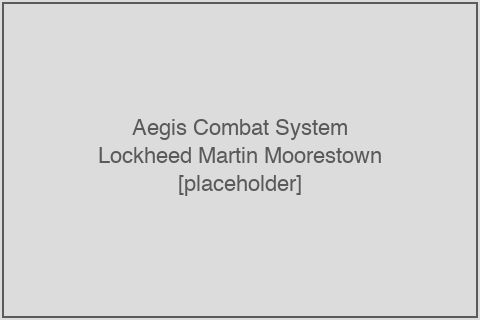
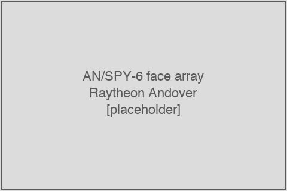

# Aegis Combat System and AN/SPY-6 radar

<figure class="float-right"><figcaption>An Aegis Combat System workstation at Lockheed Martin Moorestown, NJ. (Placeholder.)</figcaption></figure>

The two largest dollar buckets in the supplier-TAM-relevant DDG-51 contract action corpus are the **Aegis Combat System** (Lockheed Martin Moorestown, NJ) and the **AN/SPY-6(V)1 Air and Missile Defense Radar** (Raytheon Andover, MA). Together these two government-furnished subsystems accounted for **$5,022.9 million of the $7,134.5 million supplier-TAM-relevant corpus over the July 2022 – May 2026 window** — approximately **70 percent of the dollar-weighted DDG-51 supplier-TAM-relevant flow**. This chapter takes up both programs in detail: the contracting structure, the supplier base under each prime, the dollar trajectory and quantitative concentration, and the relationship of each to the Flight III variant transition that is driving the current production cycle.

## Aegis Combat System (Lockheed Martin Moorestown)

The **Aegis Combat System** is the integrated weapon system that ties together every sensor, every fire-control computer, every command-and-decision processor, and every launcher on an Arleigh Burke-class destroyer. It originated in the 1970s as the AN/SPY-1A radar plus the Mk 7 weapon-direction system on the U.S.S. *Ticonderoga* (CG 47); the Aegis Combat System on a current Flight III DDG-51 is a heavily-evolved descendant of that original architecture, with the SPY-1 radar replaced by AN/SPY-6, the original computers replaced by COTS hardware running the Aegis Common Source Library (ACSL) software baseline, and the original weapon direction integrated with the Mk 41 Vertical Launching System and a broad range of weapon types.

**Lockheed Martin Rotary and Mission Systems (RMS)** — formerly the Lockheed Martin Mission Systems and Sensors business — is the Aegis Combat System prime contractor. The principal Aegis facility is at **Moorestown, New Jersey**, supplemented by smaller Aegis-related work at LM Owego, NY (Aegis sub-element manufacturing), LM Manassas, VA (combat-systems software development), and LM Eagan, MN (Aegis Ashore land-based variant).

### Aegis-related PIID set

The in-scope Aegis PIIDs in the new-construction set:

| PIID | Label | Cumulative SAM subaward $M |
|---|---|---:|
| `N00024-13-C-5116` | AEGIS CSEA FUNDING MOD | 654.2 |
| `N00024-14-C-5114` | AEGIS HARDWARE | 615.4 |
| `N00024-09-C-5103` | AEGIS PLATFORM SYSTEM ENGINEERING AGENT | 0.0 (legacy/closeout) |
| `N00024-20-C-5310` | MK 41 MOD 36 VLS MODULE MECH (LM Mk 41, not Aegis core) | 1,425.5 |
| `N00024-16-C-5103` | AEGIS IMPLEMENTATION STUDIES | 464.6 |
| `N00024-15-C-5151` | AEGIS SHIP INTEGRATION | 104.8 |
| `N00024-09-C-5110` | AEGIS WEAPON SYSTEM MK 7 DDG 116 | 0.0 (legacy/closeout) |
| `N00024-14-C-5106` | AEGIS HARDWARE | 103.7 |
| `N00024-23-C-5325` | MK 41 VLS MODULE AND ANCILLARY EQUIPMENT (LM Mk 41) | 204.7 |
| `N00024-20-C-5105` | INTERNATIONAL AEGIS FIRE CONTROL LOOP | 219.4 |
| `N00024-19-C-5102` | KOREA BATCH II AEGIS COMBAT SYSTEM K2 (export) | 407.1 |
| `N00024-14-C-5104` | AEGIS SI&T INSTALLATION/MODERNIZATION (DDG and CG) | 29.8 |
| `N00024-16-C-5102` | AEGIS PLATFORM SYSTEM ENGINEERING AGENT | 0.0 (legacy/closeout) |
| `N00024-13-C-5132` | AEGIS DEVELOPMENT AND TEST SITES O&M | 8.7 |
| `N00024-15-C-5332` | USN DDG 127 MK 41 MOD 15 VLS MECH | 1,494.7 |

Cumulative FFATA-visible Aegis-related dollar value across the in-scope Aegis PIIDs (Aegis core + Mk 41 VLS production held by LM, excluding the Korea export): approximately **$4.62 billion**.

### DoD-announcement Aegis dollar value

From the DoD-announcement corpus (`extracted/dod_announcement_pop.csv` filtered on `program_primary == 'ddg_gfe_aegis'`):

- **74 actions / $3,547.8 million** in the supplier-TAM-relevant corpus
- Dollar-weighted POP: BIW 0.7%, Ingalls 0.7%, **Other-US 86.0%**, Foreign 0%
- Primary supplier city: **Moorestown, NJ** (LM Aegis facility)

The 86 percent supplier-city POP share is the highest of any program family in the corpus and reflects the structural concentration of Aegis Combat System integration work at a single Lockheed Martin Moorestown facility.

### Aegis top first-tier subawardees

From the in-scope FFATA first-tier subaward stream filtered to Aegis-related LM-prime PIIDs:

| Subawardee | Approximate cumulative $M | Role |
|---|---:|---|
| Arctic Slope Regional Corporation | 437 | Engineering services labor, $437M on `N00024-13-C-5116` alone (Aegis CSEA) |
| Mission Solutions LLC | ~860 | Combat-system integration services across multiple PIIDs |
| Indra Sistemas, Sociedad Anonima (Spain) | 83 | Aegis Hardware on FY14 master |
| Sener Tafs SA (Spain) | 67 | Aegis Hardware sub-component |
| Frontgrade Technologies Inc. | 78 | Specialty electronics |
| Datacon, Inc. | 46 | |
| RTI Remmelle Engineering, Inc. | 39 | |
| Advanced Sciences and Technologies, LLC | ~94 | Across multiple Aegis PIIDs |
| In-Depth Engineering Corporation | ~50 | Across multiple Aegis PIIDs |
| Tactical Engineering & Analysis, Inc. | ~33 | |
| Mercury Systems, Inc. | 19 | Specialty computing |
| Extreme Engineering Solutions, Inc. | 85 (`N00024-20-C-5105` International Aegis) | Embedded computing |

The Aegis supplier base concentrates around (a) engineering-services labor providers (Arctic Slope, Mission Solutions, ASTI, In-Depth, Tactical Engineering) and (b) specialty electronics and computing suppliers (Frontgrade, Datacon, Mercury Systems, Extreme Engineering). Foreign suppliers (Indra Sistemas, Sener Tafs) appear at the Spanish-Aegis export end of the supplier base — these are export-program suppliers rather than U.S. Navy-program suppliers.

### Aegis vs. AEGIS — terminology note

The official program name is **"Aegis Combat System."** "AEGIS" in all-caps appears in some older program documents and is sometimes (incorrectly) treated as an acronym; the program name is in fact named for the mythological *aegis* (Zeus's shield) and is not an acronym. The convention in this article and in most modern U.S. Navy program documentation is the title-case form "Aegis."

## AN/SPY-6(V)1 Air and Missile Defense Radar (Raytheon Andover)

<figure class="float-right"><figcaption>An AN/SPY-6(V)1 antenna face array under construction at Raytheon Andover, MA. (Placeholder.)</figcaption></figure>

The **AN/SPY-6(V)1 Air and Missile Defense Radar (AMDR)** is the Flight III DDG-51's primary search-and-track radar. It replaced the AN/SPY-1D rotating phased-array radar used on Flight IIA and earlier Burke-class destroyers. SPY-6 is an S-band active electronically scanned array (AESA) radar composed of 37 Radar Modular Assemblies (RMAs) per radar face — making each of the four faces on a Flight III destroyer a 37-RMA face. The SPY-6 is reported to be roughly 30 times more sensitive than the SPY-1D, with simultaneous ballistic-missile-defense and air-defense target-tracking capability that the SPY-1D could not handle concurrently.

**Raytheon, an RTX business** (the former Raytheon Company, post the April 2020 Raytheon Technologies merger with UTC), is the SPY-6 prime contractor. The principal SPY-6 facility is at **Andover, Massachusetts**, with module-level manufacturing at multiple specialty supplier sites across the country.

### SPY-6-related PIID set

The in-scope SPY-6 PIIDs in the new-construction set:

| PIID | Label | Cumulative SAM subaward $M |
|---|---|---:|
| `N00024-22-C-5500` | DDG FLT III (AN/SPY-6(V)1) | 1,502.2 |
| `N00024-14-C-5315` | AMDR EMD (BASE) | 0.0 (EMD phase closed; production now on -5500) |

Cumulative FFATA-visible SPY-6 dollar value: approximately **$1.50 billion** against the principal production PIID `N00024-22-C-5500`.

### DoD-announcement SPY-6 dollar value

From the DoD-announcement corpus (`extracted/dod_announcement_pop.csv` filtered on `program_primary == 'ddg_gfe_radar'`):

- **7 actions / $1,475.1 million** in the supplier-TAM-relevant corpus
- Dollar-weighted POP: BIW 0.0%, Ingalls 0.0%, **Other-US 82.0%**, Foreign 0%
- Primary supplier city: **Andover, MA** (Raytheon SPY-6 facility)

The 82 percent supplier-city POP share is the second-highest of any program family in the corpus, reflecting the SPY-6's heavy concentration at Andover.

### SPY-6 top first-tier subawardees

From the in-scope FFATA first-tier subaward stream filtered to the SPY-6 production PIID `N00024-22-C-5500`:

| Subawardee | Cumulative subaward $M | Role |
|---|---:|---|
| General Dynamics Mission Systems, Inc. | 362.5 | Radar receiver/exciter and signal-processor electronics |
| CAES Systems LLC | 173.3 | RF circuits and specialty electronics (Cobham Advanced Electronic Solutions parent) |
| Northrop Grumman Systems Corporation | 151.2 | Sub-assembly and integration support |
| Golden Star Technology Inc. | 85.9 | Electronics distribution |
| Anaren, Inc. | 60.6 | RF microwave components |
| Cobham Advanced Electronic Solutions | (additional via CAES) | RF / microwave content |
| Communications & Power Industries LLC | (smaller dollar) | High-power RF amplifiers |
| Amphenol Corporation | (across multiple PIIDs) | Interconnects |

The SPY-6 supplier base is dramatically more concentrated than the Aegis supplier base: the top 3 subawardees (GD Mission Systems, CAES, Northrop Grumman) account for approximately $687M of the $1,502M cumulative — **~46 percent supplier concentration in the top 3**. This is consistent with the SPY-6's hardware-intensive nature: the bulk of the work is RF-circuit and signal-processor electronics manufacturing, which is performed by a small number of specialty defense-electronics suppliers.

### The SPY-6 EMD-to-production transition

SPY-6 development was funded under EMD PIID `N00024-14-C-5315` (Engineering, Manufacturing, and Development - Base) — a Raytheon Andover prime contract that ran from approximately 2014 through 2021 to develop the AMDR design through to production-readiness. Production transitioned to the principal Flight III production PIID `N00024-22-C-5500` ("DDG FLT III (AN/SPY-6(V)1)") in 2022.

The transition is visible in the FFATA filings as a sharp shift in subaward activity: the EMD PIID has approximately $0M of subaward filings at the May 2026 pull (residual close-out activity only), while the production PIID has approximately $1,502M of filings and 1,057 records. The transition is associated with the FY22-and-forward Flight III production ramp and the corresponding supplier-base ramp at Andover and at the major sub-component suppliers (GD Mission Systems for receiver/exciter, CAES Systems for RF circuits).

## Combined Aegis + SPY-6 dollar value

Together the Aegis core PIIDs plus the Mk 41 VLS production PIIDs (LM-held but tightly coupled with the Aegis combat-system architecture) plus the SPY-6 production PIID account for the following cumulative FFATA-visible flow on the in-scope set:

- Aegis core + Aegis-related (excluding Korea export): approximately $4.7 billion
- Mk 41 VLS production (LM-held, included with Aegis in some categorizations): ~$1.4 billion on `N00024-20-C-5310` plus $1.5 billion on the legacy `N00024-15-C-5332`
- SPY-6 production: approximately $1.5 billion
- **Combined Aegis + Mk 41 + SPY-6 cumulative FFATA-visible: approximately $9.1 billion** across the FY02–FY26 window

This is approximately **66 percent of the total $13.84 billion in-scope FFATA-visible flow**, demonstrating the dominance of the Aegis + Mk 41 + SPY-6 combat-system layer in the destroyer outsourcing pattern. The remaining $4.7 billion of in-scope FFATA flow distributes across the yard subaward streams (BIW + Ingalls combined ~$2.5B), the Raytheon CIWS PIID ($1.1B), the BAE-Guns/VLS canister + Mk 45 contracts (~$3B combined including the IVECO-contaminated Mk 110 PIID), and the smaller DRS / GD / GE / NG contracts.

## Construction-cycle observation

The Aegis and SPY-6 production ramps are tightly coupled with the destroyer construction-cycle. Each Flight III DDG receives one Aegis Baseline 10 combat-system installation (which incorporates SPY-6) and one Mk 41 VLS module-mechanical-equipment delivery. The first Flight III destroyer was **DDG 125** *Jack H. Lucas* (delivered 2023 to HII Ingalls); subsequent Flight III deliveries include DDG 126, DDG 127, DDG 129, DDG 130, and onward.

The schedule-criticality of Aegis and SPY-6 deliveries is one of the principal supply-chain stress points in the destroyer program. Both Lockheed Martin and Raytheon have publicly discussed supply-chain stress in their earnings calls (chapter 13), and both programs have been described in trade-press reporting as "ahead of pace" or "behind pace" depending on the specific ship's construction window. The Aegis baseline-software development cycle in particular is reported to be a sustained pressure point: combat-system software certification for Flight III is integrated with new ship deliveries on a roughly hull-by-hull basis.

## Foreign-Aegis variants

A separate stream of Aegis dollars supports **foreign military sales (FMS)** Aegis baselines for allied surface combatants — most prominently the Japan Maritime Self-Defense Force *Maya*-class destroyers (Aegis Baseline 9), the Republic of Korea Navy KDX-III Batch II *Jeongjo the Great*-class destroyers (the K2 baseline funded under `N00024-19-C-5102` in the in-scope set at $407M cumulative subaward), and the Royal Norwegian Navy and Royal Australian Navy *Hobart*-class derivatives.

These export-Aegis flows appear in the FPDS prime-contract data but are excluded from the headline TAM gate as **out-of-scope FMS work**. They are tagged separately. The Korea Batch II contract `N00024-19-C-5102` is the largest single FMS-Aegis contract in the in-scope set; its top subawardees (per `sam_subawards/N00024-19-C-5102_subawards.json`) include Mission Solutions LLC at $181.8M, Hanwha Systems Co., Ltd. (South Korea) at $84.4M, Extreme Engineering Solutions at $62.8M, and Hanwha Systems Co., Ltd. (different filing variant) at $26.9M.

## Combat-system electronics — the lower bound

A small set of additional combat-system electronics flows complete the Aegis-supporting layer:

- **AN/SPQ-9B X-band horizon-search radar** (Northrop Grumman Linthicum, MD) — added on Flight III for surface and low-altitude threat detection. Approximately $258M cumulative subaward value across the NG-prime in-scope PIIDs (multi-PIID rollup).
- **AN/USG-2B and AN/USG-3B Cooperative Engagement Capability (CEC)** hardware (DRS Laurel Technologies, a Leonardo DRS subsidiary, plus L3Harris) — networked fire-control data sharing across multiple Aegis ships. The CEC PIID `N00024-15-C-5228` has approximately $35M of subaward filings; the related `N00024-20-C-5605` ("ESTABLISH AND FUND SLINS") has approximately $155M.
- **AWS Director / Director Controller** (General Dynamics Mission Systems) — the "Aegis Director" subsystem coordinating fire-control across multiple weapons. Smaller PIID values; GD Mission Systems is the FY27 P-5b contractor.

DoD-announcement actions tagged `ddg_gfe_combat_systems` (a catchall for these smaller combat-system flows) total 8 actions / $252.5M in the supplier-TAM-relevant corpus, with dollar-weighted POP at 0% BIW / 0% Ingalls / **100% Other-US** — the most concentrated bucket at supplier sites.

## Why the GFE concentration matters

The 86 percent Aegis supplier-city POP share and the 82 percent SPY-6 supplier-city POP share, when combined into the dollar-weighted aggregate, account for the bulk of the chapter 4 headline finding that "approximately 87 percent of dollar-weighted POP flows outside the two destroyer shipyards." This is a structural feature of the destroyer program: the dominant outsourced-share driver is the GFE concentration at a small number of single supplier sites — Moorestown NJ for Aegis, Andover MA for SPY-6, plus the Mk 41 VLS supplier base discussed in chapter 11.

For an analytical reader focused on the question "where would investment in destroyer supplier-base capacity move the needle most," the answer points strongly at Moorestown and Andover (and at the second-tier Aegis and SPY-6 suppliers in the broader Northeast electronics-manufacturing corridor) rather than at the two prime yards. The yard-side outsourcing flow estimated at $1.8B/yr (chapter 9) is real and material, but it is dwarfed in the supplier-TAM-relevant DoD-announcement corpus by the GFE combat-system flow at the two single-site GFE primes.
