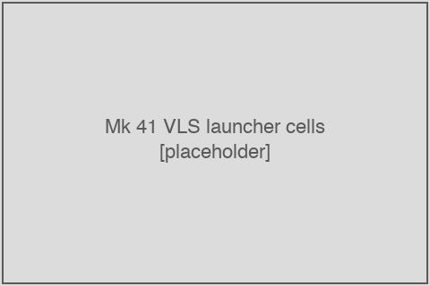
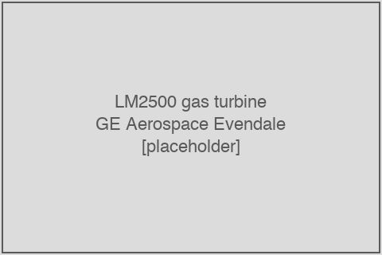

# Other GFE — Mk 41 VLS, Mk 45 gun, LM2500, SEWIP, CIWS

<figure class="float-right"><figcaption>Mk 41 VLS launcher cells installed in the forward weapon-system battery on a Flight IIA destroyer. (Placeholder.)</figcaption></figure>

This chapter takes up the government-furnished-equipment buckets that fall outside the dominant Aegis + SPY-6 combat-system suite addressed in chapter 10. These five categories — the **Mk 41 Vertical Launching System (VLS)**, the **Mk 45 5-inch / 62-caliber gun**, the **LM2500 main propulsion turbines**, the **AN/SLQ-32 SEWIP electronic-warfare suite**, and the **Mk 15 Phalanx Close-In Weapon System (CIWS)** — collectively account for an additional **$1.1 billion of supplier-TAM-relevant DoD-announcement dollar value** (plus a substantially larger flow under the WPN/OPN-funded CIWS and missile streams that are not in the SCN-scope TAM gate) and an additional **$3.6 billion of in-scope FFATA-visible cumulative subaward value**. The chapter covers each program's contracting structure, supplier base, geographic concentration, and concentration risk.

## Mk 41 Vertical Launching System (Lockheed Martin)

The **Mk 41 Vertical Launching System (VLS)** is the DDG-51's missile launcher — a multi-cell vertical-tube launcher that fires Standard Missile-2, Standard Missile-3, Standard Missile-6, Evolved Sea Sparrow Missile (ESSM), Vertical Launch Anti-Submarine Rocket (VLA), and Tomahawk land-attack cruise missile. Each Flight IIA and Flight III DDG carries **96 VLS cells** (32 forward + 64 aft), arranged in 8-cell modules in a 2×4 configuration per module.

**Lockheed Martin Rotary and Mission Systems** is the prime for the Mk 41 launcher mechanical assembly. Structural manufacturing is performed by specialty subcontractors. The principal in-scope Mk 41 PIIDs:

- `N00024-20-C-5310` ("MK 41 MOD 36 VLS MODULE MECH") — the principal current production contract, with **$1,425.5 million cumulative SAM-visible subaward value** across 834 records
- `N00024-23-C-5325` ("MK 41 VLS MODULE AND ANCILLARY EQUIPMENT") — follow-on production with $204.7M of subaward filings
- `N00024-15-C-5332` ("USN DDG 127 MK 41 MOD 15 VLS MECH") — legacy FY15 master, $1,494.7M cumulative subaward

The Mk 41 VLS canisters (Mk 13, Mk 21, Mk 25) — the metal tubes that hold individual missiles inside the launcher — are procured separately under **BAE Systems Land & Armaments** prime contracts (PIIDs `N00024-13-C-5314`, `N00024-20-C-5380`, `N00024-24-C-5324`, `N00024-12-C-5311`). These are tagged as a separate sub-bucket within the `ddg_gfe_vls` family.

### Mk 41 dollar value in the DoD-announcement corpus

- **16 actions / $533.4 million** in the supplier-TAM-relevant `ddg_gfe_vls` corpus
- Dollar-weighted POP: BIW 0.2%, Ingalls 0.2%, **Other-US 95.0%**, Foreign 0%

The 95 percent supplier-city POP share is the highest of any program family in the corpus, reflecting the Mk 41's tight supplier-base concentration at a small number of specialty machining and assembly sites.

### Mk 41 top first-tier subawardees

From the in-scope FFATA stream filtered to LM Mk 41 PIIDs (`N00024-20-C-5310`, `N00024-23-C-5325`, `N00024-15-C-5332`):

| Subawardee | Cumulative subaward $M (Mk 41 PIIDs only) | Role |
|---|---:|---|
| Leonardo S.p.A. (via DRS Defense Solutions) | ~712 | Major DRS-VLS-Bridgeport-CT VLS canister and launcher-cell module work, plus shared overhead with the larger DRS / Aegis flow |
| Major Tool & Machine Inc (Indianapolis, IN) | ~377 (`N00024-20-C-5310`) + $91 (`N00024-23-C-5325`) + $476 (`N00024-15-C-5332`) | Large precision-machining of VLS launcher cell structures |
| Superior Electromechanical Component Service | ~110–146 (across multiple Mk 41 PIIDs) | Electromechanical assembly |
| Merrill Aviation, Inc. / Merrill Tool Holding Company | ~72–96 | Specialty tooling and assembly |
| Sioux Manufacturing Corporation (Sioux Falls, SD) | ~20 | VLS cell components |
| AM and S MFG, Inc. | ~14 | |
| Seyer Industries, Inc. | ~35 | |
| GMT LLC / GMT Corporation | ~20 | |

The Mk 41 supplier base is dominated by **Leonardo S.p.A. via the DRS subsidiary** (whose ownership of the VLS canister manufacturing capacity at Bridgeport, CT, is a critical chokepoint in the U.S. naval-ordnance supply chain) and by **Major Tool & Machine** in Indianapolis. Both are deeply specialized firms with capital equipment that would be costly and slow to replicate. The 95 percent supplier-city POP weight is the structural reflection of this hyper-concentration.

## Mk 45 5-inch / 62-caliber gun (BAE Systems Land & Armaments)

The **Mk 45 5-inch / 62-caliber naval gun** is the DDG-51's primary surface-fire gun. The current Mod 4 variant has a 62-caliber barrel (vs. the 54-caliber barrel of earlier Mod 0–3 variants) and incorporates an automated loading and ammunition-handling system. **BAE Systems Land & Armaments** holds the prime contract, with production at **Louisville, Kentucky** (gun mount, barrel, breech) and **Minneapolis, Minnesota** (gun-fire-control electronics, formerly under the Alliant Techsystems / ATK Munition Systems business that was acquired into the BAE Land & Armaments unit).

### Mk 45 dollar value in the DoD-announcement corpus

- **5 actions / $117.4 million** in the supplier-TAM-relevant `ddg_gfe_guns` corpus
- Dollar-weighted POP: BIW 0.0%, Ingalls 0.0%, **Other-US 100.0%**, Foreign 0%

The 100 percent supplier-city POP weight (all at BAE Louisville and Minneapolis) reflects the gun's straightforward outside-yards origin.

### Mk 45 PIID and supplier base

The principal in-scope Mk 45 PIID is `N00024-19-C-0004` ("MK45 PRODUCTION CONTRACT"), with $32.8M of FFATA-visible cumulative subaward value across 316 records. Top subawardees include Rhinestahl Corporation ($2.7M), Ranor Inc. ($2.1M), Futuramic Tool & Engineering Company ($1.6M), Electromech Technologies LLC ($1.6M, formerly Key Tronic), and Production Engineering Corporation ($1.2M).

The dollar volume is small relative to the Aegis and SPY-6 buckets — Mk 45 production is a low-volume, high-mix item with a modest annual run rate. Replacement Mk 45 guns are procured once every several years; refurbishment and ammunition-handling-system upgrade contracts make up the bulk of recurring activity.

The same BAE Land & Armaments business also holds the **VLS canister** contracts (Mk 13, Mk 21, Mk 25) under the in-scope set. These canister contracts collectively represent approximately $560M of FFATA-visible subaward flow (sum of `N00024-13-C-5314` $151M + `N00024-20-C-5380` $298M + `N00024-24-C-5324` $79M + `N00024-12-C-5311` $17M + smaller). Top canister-PIID subawardees include Applied Composite Structures (formerly Applied Industries), DUCOMMUN LaBarge Technologies, Hutchinson Aerospace & Industry, Production Engineering Corporation, Taylor Devices, AC&A Enterprises Holdings, and Cartridge Actuated Devices.

The same BAE Land & Armaments parent UEI also files subawards against a large amphibious-warship Mk 110 57-mm gun PIID `M67854-16-C-0006` — the source of the IVECO Defence Vehicles contamination discussed in chapter 6.

## LM2500 Marine Gas Turbine (GE Aerospace)

<figure class="float-right"><figcaption>An LM2500-class marine gas turbine at GE Aerospace Evendale, OH. (Placeholder.)</figcaption></figure>

The **LM2500 marine gas turbine** is the DDG-51's main propulsion engine. Each destroyer carries **four LM2500-class turbines** (two per shaft, twin-shaft configuration), with each turbine producing approximately 26,250 shaft horsepower for a total propulsion package of approximately 105,000 SHP. The LM2500 is an adapted CF6 commercial jet engine, originally developed by General Electric in the 1960s for U.S. Navy use and now operated by approximately 30 navies worldwide.

**GE Aerospace** (spun off from General Electric Company as a separate public company in April 2024) holds the prime contract, with production at **Evendale, Ohio** (the principal GE Aerospace facility) and **Lynn, Massachusetts** (a sub-component facility historically associated with GE small-aircraft engines). Recent LM2500-class procurements use a variant called the **LM2500+G4** with improved fuel efficiency.

### LM2500 PIID set

LM2500 PIIDs are issued under the Naval Air Systems Command (NAVAIR) rather than NAVSEA — a historical artifact of the LM2500's origin as an adapted aircraft engine. The PIID prefix is `N00019` (NAVAIR Patuxent River) rather than `N00024` (NAVSEA Washington). The in-scope LM2500 PIIDs:

| PIID | Label | Cumulative SAM subaward $M |
|---|---|---:|
| `N00019-23-C-0013` | THE PURPOSE OF THIS MODIFICATION IS TO INCORPORATE RFV-24-MV-MB-004 | 70.5 |
| `N00019-18-C-1007` | THE PURPOSE OF THIS MODIFICATION IS TO REPAIR 7 WARRANTY ENGINES AND 1 CONSIDERATION ENGINE | 17.6 |
| `N00019-18-C-1061` | THE PURPOSE OF THIS NO COST MODIFICATION IS TO EXTEND THE DELIVERY DATE OF CLIN 0403AA | 34.1 |
| `N00019-23-F-0642` | DELIVERY ADDRESS UPDATE FOR CLIN 0210 | 0 |
| `N00019-21-F-0120` | PURPOSE IS TO REPLAN AND REVISE DELIVERY SCHEDULE FOR CLIN 0001 | 0.1 |
| `N00019-11-C-0045` | ATTACH CSDR PLAN FOR LOT 19 (FY15) | 0 |
| `N00019-24-C-0019` | THE PURPOSE OF THIS MODIFICATION IS TO FUND LOT 11 AAC | 0.9 |
| `N00019-13-C-0132` | THE PURPOSE OF THIS MODIFICATION IS TO REMOVE DFAR 252.223-7008 | 0.2 |
| `N00019-17-C-0047` | THE PURPOSE OF THIS NO COST MODIFICATION IS TO REMOVE NMCI GFP LIST | 0 |

Cumulative LM2500 FFATA-visible subaward value across the in-scope set: approximately **$123 million** — substantially smaller than the dollar volumes of the Aegis and SPY-6 buckets, despite the LM2500 being a four-per-ship critical-path component. The dollar disparity reflects the LM2500's market structure: it is a mature, high-volume product (in service across many navies), and GE Aerospace performs the bulk of its production at its Evendale facility under largely-internal supply chains, with relatively few large first-tier subaward filings.

### LM2500 dollar value in the DoD-announcement corpus

- **7 actions / $192.2 million** in the supplier-TAM-relevant `ddg_gfe_propulsion` corpus
- Dollar-weighted POP: BIW 0.0%, Ingalls 0.0%, **Other-US 19.2%**, Foreign 0%

The **19.2 percent Other-US POP share** is anomalously low. The cause is a parser issue with single-supplier-no-percentage bulletin paragraphs: many LM2500 bulletin paragraphs name a single supplier city (e.g., "Evendale, Ohio") without an associated percentage, and the POP-percentage regex returns 0% in the absence of an explicit percent figure. The actual LM2500 POP is overwhelmingly at Evendale and Lynn at approximately 100% supplier-city; the residual 80.8 percent unattributed dollar value is real LM2500 work that the parser failed to assign. The patch is described in chapter 12 §"The single-supplier-no-% parser caveat."

### LM2500 top first-tier subawardees

From the in-scope FFATA stream filtered to LM2500 PIIDs:

| Subawardee | Cumulative subaward $M | Role |
|---|---:|---|
| Woodward, Inc. | 24 | Fuel-control and accessory components |
| Barnes Group Inc. | 20 | Specialty hardware |
| Parker-Hannifin Corporation | 8 | Fluid-power components |
| Berkshire Hathaway Inc. (likely via Precision Castparts or another subsidiary) | 7 | |
| Electro-Methods Inc. | 5 | |
| ATI Inc. | (~0.5) | Specialty metals |
| B & F Machine Co., Inc. | (~2.5) | |

GE Aerospace's LM2500 first-tier supplier base is characterized by **deep internal vertical integration** (GE manufactures the turbine core itself in-house at Evendale) plus a long tail of specialty-component suppliers. The relatively low FFATA-visible subaward dollar volume is consistent with this internal-manufacturing posture.

## AN/SLQ-32 SEWIP electronic-warfare suite (Northrop Grumman)

The **AN/SLQ-32 Surface Electronic Warfare Improvement Program (SEWIP)** is the destroyer's primary electronic-warfare suite, providing radar warning, electronic intelligence gathering, and (in the Block 3 production variant) active electronic-attack capability. SEWIP has progressed through three blocks: Block 1B (improved radar warning), Block 2 (enhanced ESM with better signal-classification), and **Block 3** (active electronic attack — the current major upgrade).

**Northrop Grumman Systems Corporation** is the prime contractor for SEWIP Block 3.

### SEWIP PIIDs

The in-scope SEWIP PIIDs:

| PIID | Label | Cumulative SAM subaward $M |
|---|---|---:|
| `N00024-20-C-5519` | SEWIP BLOCK 3 DMS LIFETIME BUY AWARD AND OTHER ADMINISTRATIVE CHANGES | 38.6 |
| `N00024-15-C-5319` | EMD - AN/SLQ-32(V)Y SEWIP BLOCK 3 | 0.6 |

Cumulative SEWIP FFATA-visible subaward value: approximately **$39 million** — small in absolute dollar terms.

### SEWIP top first-tier subawardees

From the principal SEWIP production PIID `N00024-20-C-5519`:

- Sypris Solutions, Inc. — $14.4M
- Kyocera Corporation — $11.0M
- Falstrom Company — $7.3M
- LTP Modern Machine Inc. — $2.9M
- TEVET Technology Solutions, L.L.C. — $0.9M

The SEWIP supplier base concentrates around specialty-electronics and machining firms. The relatively small dollar volume reflects SEWIP Block 3's relatively early production phase (the program is ramping but has not yet reached the cumulative-volume scale of Aegis or SPY-6).

A separate **AN/SPQ-9B X-band horizon-search radar** flow at Northrop Grumman (Linthicum, MD) is included in the broader chapter 6 NG-prime vendor rollup at approximately $258M cumulative across multiple PIIDs but does not appear as a distinct GFE bucket in the supplier-TAM-relevant DoD-announcement corpus because most SPQ-9B procurement is bundled with the Aegis combat-system production rather than reported as standalone NG actions.

## Mk 15 Phalanx Close-In Weapon System (Raytheon)

The **Mk 15 Phalanx Close-In Weapon System (CIWS)** is the destroyer's terminal-defense gun system against anti-ship missiles. It is a self-contained 20-mm Gatling-gun system with its own radar and fire-control electronics, mounted as a unit on the ship's superstructure. **Raytheon, an RTX business**, is the prime.

### CIWS PIID and dollar value

The principal in-scope CIWS PIID is `N00024-18-C-5406` ("MK15 PHALANX BK 0 TO 1B BL 2 U&C"), which carries the **single largest cumulative FFATA-visible subaward dollar value in the in-scope set: $1,130.9 million** across **3,661 records**. Smaller CIWS-related PIIDs (`N00038-19-F-0VP0`, `N00104-18-F-0E40`, `N00038-21-F-0ZM0`) add an additional approximately $9 million.

### CIWS is funded under WPN, not SCN

Critically, CIWS procurement is funded under **Weapons Procurement (WPN)** appropriations rather than SCN. The CIWS itself is loaded aboard the destroyer but is procured separately from the ship's hull-construction contract. Therefore CIWS PIIDs are **tagged `ddg_gfe_weapons` and excluded from the headline SCN-scope TAM gate** (`is_ddg_new_construction_tam == 'no'`). Including them would double-count against a different appropriation.

The same logic applies to **Standard Missile (SM-2/3/6), ESSM, Tomahawk, and the related missile-procurement PIIDs** — all are WPN-funded and not in the SCN scope.

This is methodologically important because the cumulative WPN-funded ordnance flow against destroyers (CIWS + Standard Missile + ESSM + Tomahawk) is comparable in magnitude to the SCN-funded GFE flow at Aegis + SPY-6 + Mk 41 + Mk 45 + LM2500 + SEWIP combined. A reader interested in the *full-cost* outsourcing picture of destroyer-class supplier-base spend (including weapons) would relax the SCN TAM gate; doing so adds approximately $5 billion of additional supplier-TAM-relevant flow (Raytheon Tucson AZ for Standard Missile, Raytheon Camden NJ for Phalanx terminal-defense gun, etc.) to the corpus. The SCN-only convention used in the chapter 4 headline is the more conservative measurement.

### Top CIWS first-tier subawardees

From the principal CIWS PIID `N00024-18-C-5406`:

- Leonardo S.p.A. (via DRS) — $141.0M
- General Dynamics Corporation — $90.3M
- Honeywell International Inc. — $72.1M
- L3Harris Technologies, Inc. — $54.2M
- DRS Network & Imaging Systems LLC — $35.7M
- (Many additional vendors across the 3,661 records)

The CIWS supplier base is the largest single-PIID supplier base in the in-scope FFATA set, reflecting the CIWS's complex multi-supplier supply chain (RF microwave electronics, mechanical-fire-control assembly, Gatling-gun ammunition handling, the M61 Vulcan core).

## ESSM Block 2 — a methodological case study

The **Evolved Sea Sparrow Missile Block 2** (ESSM Blk 2) is an updated short-range air-defense missile that the U.S. Navy and 9 partner nations (the ESSM NATO cooperative-development consortium) jointly developed. The principal ESSM Blk 2 PIIDs in the in-scope set are `N00024-15-C-5420` ("EMD FOR ESSM BLOCK 2") at $243.8M cumulative subaward and `N00024-21-C-5408` ("ESSM BLK 2 FY21-23 PART 2 SPARES") at $652.1M.

The ESSM EMD PIID `N00024-15-C-5420` was the source of the **$4.2 billion Thales Nederland B.V. record** in the USAspending pull discussed in chapter 5. This single record represents the NATO cooperative-development cost-share among the 10 partner nations — it is not U.S. Navy destroyer spend, and the SAM.gov pull correctly excludes it from the FFATA-visible flow. The contrasting USAspending and SAM.gov treatments of this record are the principal methodological reason that **SAM.gov is the canonical FFATA denominator for this analysis**.

ESSM Blk 2 is, like Standard Missile and Tomahawk and CIWS, funded under WPN rather than SCN; it is tagged `ddg_gfe_weapons` and excluded from the headline TAM gate.

## Combined other-GFE supplier-TAM-relevant dollar value

Summing the SCN-funded other-GFE buckets in the supplier-TAM-relevant corpus:

- Mk 41 VLS: $533.4M (16 actions)
- Mk 45 gun: $117.4M (5 actions)
- LM2500 propulsion: $192.2M (7 actions, with 80.8 percent unattributed POP residual)
- SEWIP: included in the smaller combat-systems and electronics buckets
- Combat-systems / CIWS (SCN-funded portion): $252.5M (8 actions)

**Combined other-GFE supplier-TAM-relevant SCN-scope flow: approximately $1.1 billion across 36 actions over the 34-month window.**

Together with the chapter 10 Aegis + SPY-6 flows of $5.0 billion across 81 actions, the combined GFE supplier-TAM-relevant flow is approximately **$6.1 billion across 117 actions over 34 months** — approximately **86 percent of the total 152-action supplier-TAM-relevant $7.1 billion corpus**.

The remaining ~$1 billion of supplier-TAM-relevant value sits in the yard-construction layer (the 20 `ddg51 construction` actions at $1.0B, with the BIW master at 76.5% Bath POP and the Ingalls master appearing in the corpus with redacted dollars), plus a small residual of engineering and lead-yard-support actions.

## Concentration risk

The combined GFE supplier base is **heavily concentrated** at a small number of single-site GFE primes, each with relatively narrow supplier bases:

- Aegis at Lockheed Martin Moorestown — single site, deep but specialized supplier base
- SPY-6 at Raytheon Andover — single site, top 3 subs = 46 percent
- Mk 41 VLS at LM with Major Tool & Machine + Leonardo/DRS supplier dominance — narrow second-tier base
- Mk 45 at BAE Louisville + Minneapolis — single-source production
- LM2500 at GE Aerospace Evendale + Lynn — substantially vertically integrated within GE
- SEWIP Block 3 at Northrop Grumman — narrow specialty-electronics second-tier
- CIWS at Raytheon (Tucson + Camden) — substantial but complex multi-supplier base

The U.S. Navy's broad concern about supplier-base fragility (developed in chapter 14) applies to several of these GFE buckets directly: a disruption at Major Tool & Machine in Indianapolis (Mk 41 VLS module fab) or at the Raytheon Andover SPY-6 facility (radar production) would propagate into the destroyer construction timeline within several months. The deep-vertical-integration GFE primes (GE Aerospace at Evendale for LM2500) are less exposed to single-supplier-failure risk, but the trade-off is that their internal manufacturing structure is opaque to FFATA observation.

The structural concentration is the principal industrial-policy concern that motivates the Navy's distributed-shipbuilding initiative (chapter 14). It is also the structural reason that the chapter 4 headline 87-percent figure understates the *operational* concentration of destroyer outsourcing: the dollar weight is distributed across multiple supplier cities (Moorestown, Andover, Indianapolis, Bridgeport, Louisville, Evendale, Linthicum), but within each city the dependency is on a small number of specialized firms.
