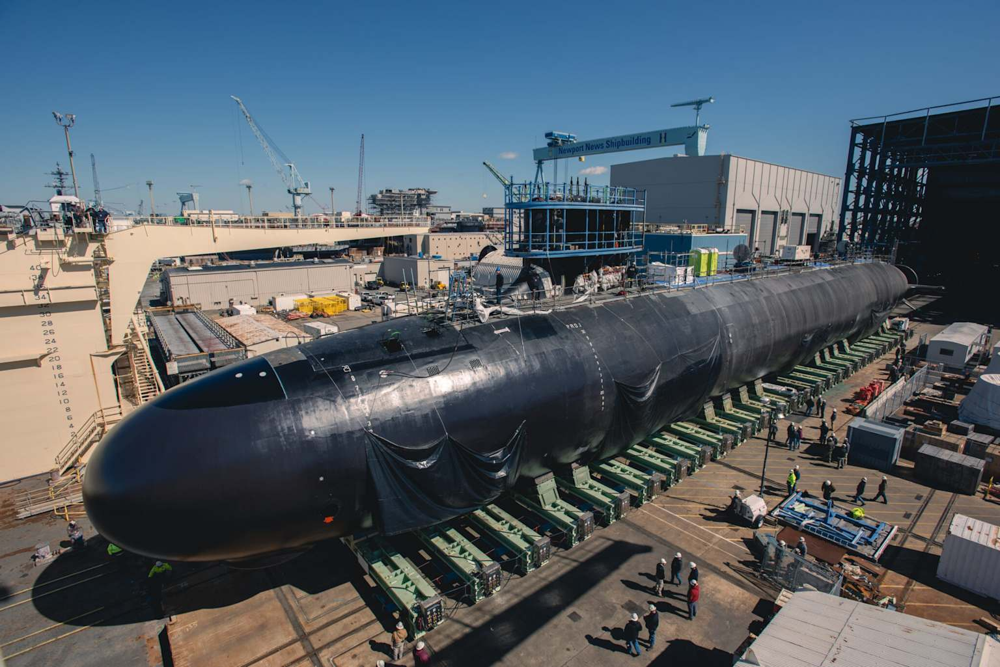

# Total ship cost

The first level of the cost funnel is the per-class per-fiscal-year top-line cost of the submarines procured under the Navy's Shipbuilding and Conversion (SCN) appropriation. This chapter documents how that cost is reported in the SCN Justification Book, how it has been revised across budget vintages, and how it cross-validates against Congressional Research Service program-cost figures. The aggregate per-class per-fiscal-year figures in this chapter are the starting point that all subsequent layers of the funnel are sized against.

## How total ship cost is reported

The U.S. Department of the Navy publishes per-line-item cost detail in the SCN Justification Book. Two exhibits matter at this level of the funnel:[^scn-fy27pb]

- **Exhibit P-40, Budget Line Item Justification** reports per-fiscal-year quantities and total obligational authority (TOA) for the line item, including a breakout of gross procurement cost, Less Prior Year Advance Procurement, Plus Current Year Advance Procurement, and Net Procurement.
- **Exhibit P-5c, Ship Cost Analysis** reports the cost-category breakdown per hull (Plans Costs, Basic Construction/Conversion, Change Orders, Electronics, Propulsion Equipment, Hull-Mechanical-Electrical, Ordnance, Other Cost, Total Ship Estimate).

For purposes of the funnel, the **Total Ship Estimate** from Exhibit P-5c is the per-hull top-line; the P-40 **Total Obligational Authority** is the per-line-item top-line including advance procurement timing effects. The two figures reconcile after the per-fiscal-year advance procurement is added back; they are not the same number for the same fiscal year because advance procurement is paid in the year before construction begins.

P-1 line numbers drift across Justification Books — Virginia's P-1 line number was 5 in the FY2022 through FY2025 books, then 8 in FY2026, then 6 in FY2027 — but the underlying Line Item numbers are stable. **Columbia is Line Item 1045 and Virginia is Line Item 2013** throughout, and this article uses LI numbers for cross-vintage stability.

## Multi-vintage reconciliation

Per-fiscal-year cost figures get revised in subsequent Justification Books. A fiscal year that appears as the "estimate" column in one book becomes the "actual" column in the next, frequently with material changes due to inflation, shipbuilder performance, contract restructuring, or scope adjustments. To produce per-fiscal-year figures that reflect the most accurate available information, the article uses the most recent Justification Book that shows the target fiscal year as a settled actual (or, for outyears, the most recent book that shows it at all).

The revisions across vintages are substantial. Virginia fiscal year 2025 is the largest single example: the FY2023 Justification Book (PB23) reported an FY2025 estimate of approximately $8.7 billion; the FY2027 Justification Book (PB27) shows the same fiscal year as an actual of approximately $13.3 billion. The corresponding Columbia line for FY2025 was revised from approximately $7.2 billion in PB23 to approximately $9.6 billion in PB27. The drivers cited in the FY24-FY27 Justification Book narratives include inflation, the lead-Columbia 17-month delay first acknowledged in the FY2026 budget submission, shipbuilder performance issues on SSBN-826 and SSBN-827 that consumed schedule margin, and the Maritime Industrial Base ramp.[^crs-r41129]

## Per-class per-fiscal-year top-line

The table below presents per-class per-fiscal-year procurement quantity, gross unit cost, Total Ship Estimate (P-5c), and Total Obligational Authority (P-40 net procurement plus current-year advance procurement). All values are nominal then-year dollars. Fiscal years before FY2020 are not reported here because the article's substantive coverage begins FY2020; earlier values for active programs (Columbia and Virginia Block IV, V, VI) are aggregated as "Prior Years" in the books.

### Columbia (Line Item 1045)

| FY | Qty | Hull | Unit cost $M | Total Ship Estimate $M | TOA $M | Source vintage |
|---:|---:|:--:|---:|---:|---:|:--|
| 2020 | 0 | (AP only) | — | — | 1,820.9 | PB22 |
| 2021 | 1 | SSBN-826 | 15,179.1 | 16,121.6 | 4,122.2 | PB23 |
| 2022 | 0 | (AP only) | — | — | 4,777.0 | PB24 |
| 2023 | 0 | (AP only) | — | — | 5,857.8 | PB25 |
| 2024 | 1 | SSBN-827 | 10,688.5 | 10,688.8 | 7,789.3 | PB26 |
| 2025 | 0 | (AP only) | — | — | 9,580.8 | PB27 |
| 2026 | 1 | SSBN-828 | 10,744.3 | 10,744.3 | 9,279.6 | PB27 |
| 2027 | 1 | SSBN-829 | 10,486.4 | 10,486.4 | 15,583.1 | PB27 |

The Columbia procurement profile alternates between AP-only years (no boat procured) and construction-funded years (one boat procured) through the early build. The lead boat SSBN-826 carries a much higher Total Ship Estimate ($16,121.6 million) than the second hull SSBN-827 ($10,688.8 million) because the lead-boat figure absorbs non-recurring design and tooling costs, and because Plans Cost loading is concentrated on the first hull — Plans Costs alone account for approximately $6,946 million of the SSBN-826 Total Ship Estimate.

<figure class="float-right"><figcaption>A Virginia-class submarine on its building cradle prior to launch. The FY2027 PB places per-boat Virginia cost at approximately $5.0 to $5.7 billion at the two-per-year build rate.</figcaption></figure>

### Virginia (Line Item 2013)

| FY | Qty | Hulls | Unit cost $M | Total Ship Estimate $M | TOA $M | Source vintage |
|---:|---:|:--:|---:|---:|---:|:--|
| 2020 | 2 | Block V | 3,741.8 | — | 8,334.7 | PB22 |
| 2021 | 2 | Block V | 3,607.6 | — | 6,776.4 | PB23 |
| 2022 | 2 | Block V | 3,450.4 | 6,915.8 | 6,339.6 | PB24 |
| 2023 | 2 | Block V | 3,625.3 | 7,250.6 | 6,864.5 | PB25 |
| 2024 | 2 | Block V | 5,688.8 | 11,377.6 | 10,656.9 | PB26 |
| 2025 | 1 | Block VI | 9,500.5 | 9,500.5 | 13,320.2 | PB27 |
| 2026 | 1 | Block VI | 5,389.1 | 5,389.1 | 6,377.5 | PB27 |
| 2027 | 2 | Block VI | 5,718.5 | 11,437.0 | 13,151.3 | PB27 |

The Virginia program transitions from Block V (FY2019-FY2023) to Block VI in FY2024-FY2028. The block transition is visible in the FY2024 → FY2025 step in unit cost, where the FY2024 unit cost of $5,688.8 million reflects the final Block V hulls and the FY2025 unit cost of $9,500.5 million reflects the first Block VI hull at single-boat-per-year rate. The Congressional Research Service reports a Virginia per-boat procurement cost of approximately $5.0 billion under a two-per-year build rate per the FY2026 budget submission; the FY2027 PB-book figures of $5.4–5.7 billion per boat are consistent with this benchmark at the FY2026–FY2027 build cadence.[^crs-rl32418]

## Cross-validation against Congressional Research Service per-boat costs

The Congressional Research Service publishes per-boat cost figures for Columbia in the dedicated report *Navy Columbia (SSBN-826) Class Ballistic Missile Submarine Program: Background and Issues for Congress* (R41129), updated periodically. The December 2025 update reports the following per-boat Columbia costs, drawn from the Navy's FY2025 budget submission:[^crs-r41129]

| Hull | CRS R41129 (Dec 2025) | This article (PB27) | Reconciliation |
|---|---:|---:|:--|
| SSBN-826 (lead) | $16,121.3M | $16,121.6M | matches |
| SSBN-827 (2nd) | $10,688.5M | $10,688.8M | matches |
| SSBN-828 (3rd) | $10,543.7M | $10,744.3M | 1.9% diff, vintage |

The minor difference on SSBN-828 ($200 million) is attributable to a vintage update between the Navy's FY2025 budget submission (the CRS source) and the FY2027 budget submission (this article's source).

The Congressional Research Service further reports that the **12-ship Columbia class total procurement cost** is $126.4 billion in then-year dollars per the FY2025 budget submission, a 15.2 percent increase over the $109.8 billion figure in the FY2021 budget submission. The Congressional Budget Office's independent estimate for a 12-ship program is approximately 16 percent higher than the Navy's, implying a CBO estimate of approximately $146 billion.[^crs-r41129]

For Virginia, CRS RL32418 (January 2026) reports the per-boat procurement cost as "about $5.0 billion each" under a two-per-year build rate per the FY2026 budget submission, with class-wide procurement cost figures consistent with the PB27 line-item totals.[^crs-rl32418]

## Lead-boat schedule pressure

The CRS Columbia report documents two schedule data points that are relevant to the cost-revision pattern visible across budget vintages:[^crs-r41129]

- The FY2026 budget submission updated the estimated delay in delivery of the lead Columbia (SSBN-826) to **17 months** beyond the contractual schedule.
- The lead boat is currently tracking to a **96-month build** instead of the 84-month contractual timeline.

The Government Accountability Office identifies the late delivery of the SSBN-826 turbine generator — supplied by subcontractor Northrop Grumman — as one of the most significant single-supplier-driven contributors to the lead-boat delay.[^crs-r41129] The implication for the cost funnel is that the per-fiscal-year top-line figures continue to revise upward as the program absorbs schedule slip and the supplier-base capacity expansion required to maintain build rate. The Ohio class begins retiring in 2027, and the lead Columbia must be ready for first patrol in fiscal year 2031 to avoid a gap in the strategic-deterrence requirement.[^gao-24-107732]

## Summary

Total ship cost is the top of the cost funnel. The figures in this chapter are the denominators that everything else in the article sizes against:

- Columbia: approximately $10.5–10.7 billion per boat at steady-state production after the lead, with the FY2021 lead boat at $16.1 billion absorbing non-recurring design content; total 12-ship class procurement cost approximately $126.4 billion (Navy) to $146 billion (CBO).
- Virginia: approximately $5.0–5.7 billion per boat at two-per-year production; reduced to approximately $9.5 billion at one-per-year build rate as Block VI begins; FY2027 PB shows a return to two-per-year procurement at $5.7 billion per boat.

The next three chapters decompose this top-line into Plans, Government-Furnished Equipment, Basic Construction, and Other — the four cost-category layers reported on Exhibit P-5c. Basic Construction is the layer the rest of the article is principally about.

[^scn-fy27pb]: U.S. Department of the Navy, Fiscal Year 2027 President's Budget, *Shipbuilding and Conversion, Navy* (SCN) Justification Book, April 2026. Approximately 700 pages. Line Item 1045 Columbia Class Submarine (P-1 Line #1, 12-ship class total) and Advance Procurement (P-1 Line #2). Line Item 2013 Virginia Class Submarine (P-1 Line #6) and Advance Procurement (P-1 Line #7). Available via the Office of the Assistant Secretary of the Navy (Financial Management & Comptroller) at <https://www.secnav.navy.mil/fmc/fmb/Pages/Fiscal-Year-2027.aspx>. Prior-vintage books (FY22–FY26 PB) used for multi-vintage reconciliation are accessible via the same site's archive.

[^crs-r41129]: Congressional Research Service, *Navy Columbia (SSBN-826) Class Ballistic Missile Submarine Program: Background and Issues for Congress* (R41129), Ronald O'Rourke, December 4, 2025. The 12-ship class total of $126.4 billion (Navy, FY2025 budget submission) and the 15.2 percent increase from the $109.8 billion figure in the FY2021 budget submission. CBO estimate "16 percent higher than the Navy's." Per-boat costs: SSBN-826 $16,121.3 million; SSBN-827 $10,688.5 million; SSBN-828 $10,543.7 million. Lead-boat 17-month delay first acknowledged in the FY2026 budget submission. The 96-month-vs-84-month tracking discrepancy. Northrop Grumman turbine generator as a specific late-delivery supplier issue. <https://www.congress.gov/crs-product/R41129>.

[^crs-rl32418]: Congressional Research Service, *Navy Virginia (SSN-774) Class Attack Submarine Program and AUKUS Submarine (Pillar 1) Project: Background and Issues for Congress* (RL32418), Ronald O'Rourke, January 26, 2026. Per-boat Virginia cost "about $5.0 billion each" under two-per-year build rate per FY2026 budget submission. <https://www.congress.gov/crs-product/RL32418>.

[^gao-24-107732]: U.S. Government Accountability Office, *Columbia Class Submarine: Overcoming Persistent Challenges Requires Yet Undemonstrated Performance and Better-Informed Supplier Investments*, GAO-24-107732, September 30, 2024. "As Ohio class submarines begin to retire in 2027, the lead Columbia class submarine must be ready for its first patrol in fiscal year 2031 to avoid a gap in deterrence requirements." <https://www.gao.gov/products/gao-24-107732>.
