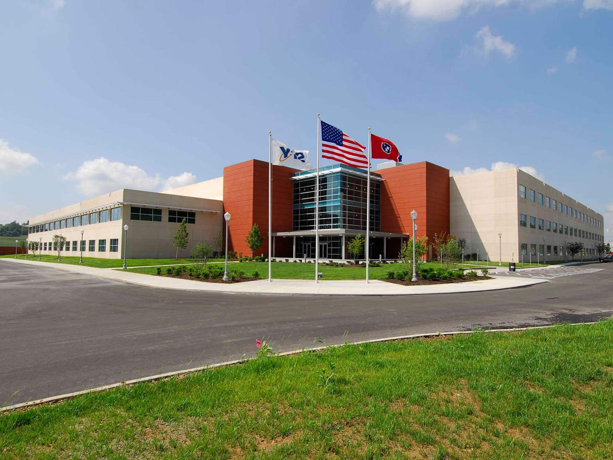

# Plans, GFE, and other layers

The U.S. Navy's SCN Exhibit P-5c, Ship Cost Analysis, decomposes the Total Ship Estimate into approximately nine cost categories. One of those categories — Basic Construction/Conversion — is the prime contract base that the next chapter covers; the other eight categories collectively represent the cost layers above and around Basic Construction. This chapter documents those layers: **Plans Costs** (engineering, design, and program-office labor), **Change Orders** (engineering change proposals and reserves), the four **government-furnished equipment** categories (Propulsion Equipment, Electronics, Hull-Mechanical-Electrical, Ordnance), and the **Other Cost** residual line.

Of the per-class per-fiscal-year Total Ship Estimate, **Plans Costs and GFE together typically account for 30 to 60 percent** of the value depending on the build phase and class, with Plans Costs concentrated on lead boats and GFE roughly steady at 15 to 30 percent across hulls. The dollars in these categories are largely outsourced from the SCN perspective — they flow to firms other than the assembling shipyard — but they are out of scope of the GDEB prime contract and therefore do not appear in GDEB's first-tier subaward tree. This chapter sets out the line-by-line cost shares for the Columbia and Virginia programs and identifies the primary firms behind each category.

## P-5c cost-category structure

The Ship Cost Analysis exhibit reports a per-hull breakdown that, for submarines, follows a stable structure across vintages:[^scn-fy27pb]

```text
Total Ship Estimate
├── Plans Costs                        (engineering, NRE, lead-yard support)
├── Basic Construction / Conversion    (the prime construction contract base)
├── Change Orders                      (ECPs, growth, reserves)
├── Electronics                        (GFE — combat systems, sonar, EW, etc.)
├── Propulsion Equipment               (GFE — reactor plant, propulsor)
├── Hull-Mechanical-Electrical         (GFE — auxiliary machinery, HM&E)
├── Ordnance                           (GFE — torpedo tubes, weapons launchers)
└── Other Cost                         (residual line items)
```

The four GFE categories (Electronics, Propulsion Equipment, Hull-Mechanical-Electrical, Ordnance) are aggregated as the "GFE sum" throughout this article for purposes of the cost funnel. Plans Costs, Change Orders, and Other Cost are separately reported. The remainder — Basic Construction — is the prime contract base addressed in [Basic Construction](04-basic-construction.md).

## Columbia: per-fiscal-year cost-category shares

The table presents the per-fiscal-year P-5c breakout for Columbia hulls that have published P-5c data. All values in millions of nominal then-year dollars.

| FY | Hull | Plans | GFE sum | Other + CO | Basic Constr. | Total Ship Est. | Plans % | GFE % |
|---:|:--|---:|---:|---:|---:|---:|---:|---:|
| 2021 | SSBN-826 | 6,946.3 | 2,727.7 | 468.2 | 5,979.4 | 16,121.6 | 43.1% | 16.9% |
| 2024 | SSBN-827 | 1,443.3 | 2,560.5 | 328.9 | 6,356.1 | 10,688.8 | 13.5% | 24.0% |
| 2026 | SSBN-828 | 1,095.8 | 2,125.0 | 363.7 | 7,159.8 | 10,744.3 | 10.2% | 19.8% |
| 2027 | SSBN-829 | 861.5 | 2,422.2 | 348.9 | 6,853.7 | 10,486.4 | 8.2% | 23.1% |

The Columbia lead boat (SSBN-826) carries an extraordinary Plans Cost loading: $6,946 million of plans-and-engineering cost out of a $16,121 million Total Ship Estimate — 43.1 percent of the total. This figure captures the non-recurring engineering for the entire Columbia class, by Navy convention loaded onto the first hull. By the second hull (SSBN-827), Plans Costs drop to $1,443 million (13.5 percent of total), and they continue to decline gradually as program development winds down: SSBN-828 at $1,096 million (10.2 percent) and SSBN-829 at $862 million (8.2 percent).

GFE remains in a tighter band — roughly $2.1 to $2.7 billion per hull, or 17 to 24 percent of Total Ship Estimate — reflecting the per-boat content of the naval reactor plant, combat systems, sonar and electronic warfare suite, and ordnance.

## Virginia: per-fiscal-year cost-category shares

| FY | Hulls | Plans | GFE sum | Other + CO | Basic Constr. | Total Ship Est. | Plans % | GFE % |
|---:|:--|---:|---:|---:|---:|---:|---:|---:|
| 2022 | 2 | 252.4 | 1,587.4 | 232.3 | 4,758.3 | 6,915.8 | 3.6% | 23.0% |
| 2023 | 2 | 192.2 | 1,634.5 | 244.2 | 5,095.4 | 7,250.6 | 2.6% | 22.5% |
| 2024 | 2 | 207.2 | 1,683.8 | 271.0 | 9,070.8 | 11,377.6 | 1.8% | 14.8% |
| 2025 | 1 | 2,595.8 | 1,318.2 | 156.0 | 5,326.5 | 9,500.5 | 27.3% | 13.9% |
| 2026 | 1 | 219.6 | 1,633.6 | 309.5 | 3,136.8 | 5,389.1 | 4.1% | 30.3% |
| 2027 | 2 | 223.4 | 1,898.0 | 290.4 | 8,889.3 | 11,437.0 | 2.0% | 16.6% |

Virginia has a markedly different Plans Cost profile from Columbia. The Virginia design is now in its sixth procurement block (Block VI in FY2024 onward), and the non-recurring engineering is largely amortized; per-fiscal-year Plans Costs at the two-per-year build rate are typically $200–250 million. The exception is **FY2025**, where Plans Costs spike to $2,596 million on a single boat — reflecting Block VI design and engineering investment that is recognized in that year. The Block VI investment timing is also visible in the FY2025 procurement at one boat rather than two, before the Block VI cadence ramps to two boats per year in FY2027.

GFE on Virginia runs slightly higher as a percentage than on Columbia — typically 14 to 30 percent of Total Ship Estimate — because Virginia is a smaller boat with relatively higher GFE content as a share of total cost. The FY2026 GFE share of 30.3 percent is partly driven by the one-boat-per-year denominator depressing the Total Ship Estimate.

## What the GFE categories are

The four GFE cost categories (Propulsion Equipment, Electronics, Hull-Mechanical-Electrical, Ordnance) are populated by Navy-direct prime contracts with firms other than the assembling shipyard. The principal primes:

### Propulsion Equipment — Bechtel Plant Machinery, Inc.

<figure class="float-right"><figcaption>Bechtel Plant Machinery, Inc. headquarters in Monroeville, Pennsylvania. BPMI directs naval reactor component manufacturing under U.S. Naval Reactors program oversight.</figcaption></figure>


The Propulsion Equipment line is dominated by the **naval reactor plant**. Bechtel Plant Machinery, Inc. (BPMI) is the Navy's direct prime for naval reactor components, including reactor vessels, steam generators, primary coolant system components, control rod drive mechanisms, and integrated power-plant equipment. BPMI operates under Naval Reactors' direction with facilities in Monroeville, Pennsylvania (Westinghouse heritage) and Schenectady, New York (Knolls Atomic Power Laboratory heritage).[^bpmi-role] BPMI is a private firm (a wholly owned Bechtel subsidiary) but its work is wholly directed by the Naval Reactors program office and the reactor plant is GFE to the assembling shipyard.

For Columbia, the Propulsion Equipment category in P-5c is approximately $1.5 to $1.7 billion per hull at steady state — closely matching the per-fiscal-year per-boat Nuclear Plant Long-Lead-Time Material budget reported in Exhibit P-10 (see [Long-lead and advance procurement](05-long-lead-and-advance-procurement.md)).

### Electronics — Lockheed Martin and Northrop Grumman

<figure class="float-right"><figcaption>Lockheed Martin Maritime Systems facility in Sunnyvale, California. Approximately 30 percent of Virginia Block VI combat-systems work is performed at this site.</figcaption></figure>


The Electronics cost category is dominated by combat systems and sensors. **Lockheed Martin** is the Navy's prime for the Virginia-class combat system hardware and software under PIID `N0002410C6266`, valued at approximately $899 million in cumulative obligation against a $1.37 billion ceiling.[^lm-combat-systems] **Northrop Grumman** is the principal sonar and electronic-warfare integrator, with Virginia AN/BLQ-10 electronic warfare and submarine sonar work concentrated at its Manassas, Virginia and Annapolis, Maryland facilities. The Naval Technology trade-press reporting on the Virginia Block VI long-lead-time material contract modification awarded in 2024 confirms that the bulk of the work for combat systems will take place in **Sunnyvale, California (30 percent of the effort)** — Lockheed Martin's Maritime Systems facility — with other significant sites including Chesapeake (Virginia), Minneapolis (Minnesota), York (Pennsylvania), and Tucson (Arizona).[^naval-technology-2024]

Lockheed Martin is also the prime for the **Trident II D5 / D5LE2 strategic weapon system** that arms Columbia. The Trident contract is funded outside the SCN appropriation under separate Navy Strategic Systems Programs (SSP) line items and does not appear in the SCN P-5c Electronics or Ordnance categories. It is mentioned here for completeness because public discussion of Columbia "GFE" sometimes conflates Trident with SCN-funded GFE; this article keeps them separate.

### Hull-Mechanical-Electrical — auxiliary machinery and components

The Hull-Mechanical-Electrical category covers auxiliary machinery (pumps, valves, switchgear, hydraulic systems, ventilation, environmental control) and is the most fragmented of the four GFE categories. Curtiss-Wright Electro-Mechanical Corporation supplies nuclear-grade pumps; Curtiss-Wright Flow Control Corporation supplies valves; Northrop Grumman's DRS Power & Control Technologies (now part of Leonardo) supplies power-distribution and conversion equipment; and a long tail of smaller specialty machinery firms supply individual components.

### Ordnance — torpedo tubes and launcher systems


The Ordnance category covers torpedo tubes, weapons launcher systems (including the Virginia Payload Module on Block V and later, and the Columbia missile compartment), and weapons-handling equipment. BAE Systems' Jacksonville, Florida shipyard fabricates deck modules and weapons-handling content for both classes.[^bae-jax-modules] The Virginia Payload Module Vent Valve and Tube Fabrication contracts (PIIDs `N0002416C2111` and `N0002410C2118`) are GDEB primes rather than Navy-direct primes, but they fund work that is integrated as ordnance content; in this article they are part of the GDEB scope but their P-5c content shows on the Ordnance line.

## Plans Costs and the lead-boat loading convention

The dramatic difference between Columbia's lead-boat Plans Cost loading (43.1 percent of Total Ship Estimate for SSBN-826) and Virginia's per-FY Plans Cost (typically 2 to 4 percent at the two-per-year build rate) is a function of two factors:

1. **Lead-boat convention.** The Navy by convention loads the non-recurring engineering for an entire class onto the first hull. Columbia is in lead-boat status; Virginia is in its sixth procurement block.
2. **Maritime Industrial Base loading.** Beginning in FY2023, the Columbia Plans / SIB (Submarine Industrial Base) line in Exhibit P-10 includes the per-fiscal-year MIB funding routed through the Columbia prime. For Columbia, this added approximately $541 million in FY2023, $2,355 million in FY2024, $2,077 million in FY2025, $1,692 million in FY2026, and $810 million in FY2027 to the Columbia Plans / SIB line.[^scn-fy27pb] Some of this MIB content shows as Plans Costs on Exhibit P-5c and some shows in advance procurement on Exhibit P-10; the loading varies across vintages.

The Virginia FY2025 Plans Cost spike to $2,596 million on a single boat reflects Block VI engineering and design investment recognized in that year, rather than ongoing MIB funding (which is principally routed through Columbia).

## Change Orders and Other Cost

Change Orders and Other Cost together represent 2 to 5 percent of Total Ship Estimate in most fiscal years for both classes. Change Orders capture engineering change proposals (ECPs), block modifications, and reserves authorized within the prime contract; Other Cost is a residual line that varies in content across budget vintages. Both lines are small relative to Plans, GFE, and Basic Construction, and the rest of the article does not separately track them.

## Where this leaves the funnel

After Plans, GFE, Change Orders, and Other Cost are removed from the per-class per-fiscal-year Total Ship Estimate, the remainder is **Basic Construction** — the prime contract base. For Columbia at steady state (SSBN-828 onward), Basic Construction is approximately 65 to 67 percent of Total Ship Estimate; for Virginia, Basic Construction is approximately 56 to 80 percent depending on the fiscal year (lower in years with single-boat builds or with concentrated Plans Cost loading, higher in two-boat steady-state years).

The next chapter takes this Basic Construction line as its subject. The chapter after that decomposes the long-lead-time material and advance procurement layer that sits underneath the construction-year cost figures. After both are characterized, the article addresses the central question: what share of Basic Construction is outsourced versus self-performed by the assembling yard.

## Cross-references

- For Basic Construction itself: [Basic Construction](04-basic-construction.md).
- For the Advance Procurement / Long-Lead-Time Material detail: [Long-lead and advance procurement](05-long-lead-and-advance-procurement.md).
- For the Maritime Industrial Base layer routed through the Columbia Plans / SIB line: [The Maritime Industrial Base layer](10-maritime-industrial-base.md).

[^scn-fy27pb]: U.S. Department of the Navy, Fiscal Year 2027 President's Budget, *Shipbuilding and Conversion, Navy* (SCN) Justification Book, April 2026. Exhibit P-5c Ship Cost Analysis and Exhibit P-10 Advance Procurement Requirements Analysis for Line Item 1045 (Columbia) and Line Item 2013 (Virginia). <https://www.secnav.navy.mil/fmc/fmb/Pages/Fiscal-Year-2027.aspx>.

[^bpmi-role]: Bechtel Plant Machinery, Inc., corporate description and role under the Naval Reactors program. Bechtel Corporation parent company. Manufacturing facilities in Monroeville, Pennsylvania and Schenectady, New York. See <https://www.bechtel.com/services/government-services/> and U.S. Department of Energy, Naval Reactors program documentation.

[^lm-combat-systems]: Lockheed Martin Corporation, Virginia-class submarine combat systems contract. PIID `N0002410C6266`; cumulative obligation approximately $899 million against a $1.37 billion ceiling per FPDS data. Place-of-performance at Lockheed Martin Maritime Systems, Sunnyvale, California is documented in trade-press reporting on the Virginia Block VI long-lead-time material contract action. <https://www.lockheedmartin.com/en-us/capabilities/maritime.html>.

[^naval-technology-2024]: "GDEB awarded $2.3bn contract modification for Virginia-class submarines," *Naval Technology*, 2024. Reports place-of-performance breakdown for the Virginia Block VI long-lead-time material contract modification (PIID `N0002424C2110`): "The bulk of the work will take place in Sunnyvale, California, accounting for 30% of the effort, with other significant sites including Chesapeake in Virginia, Minneapolis in Minnesota, York in Pennsylvania and Tucson in Arizona, each contributing between 3 and 4%." <https://www.naval-technology.com/news/gdeb-virginia-class-submarines-contract/>.

[^bae-jax-modules]: BAE Systems, Inc., "Submarine Products and Technology" product page. Public corporate page identifying BAE Systems' Jacksonville, Florida shipyard as building deck modules for Virginia- and Columbia-class submarines, plus weapons-handling and ordnance-system content. <https://www.baesystems.com/en-us/product/submarine-products-and-technology>.
