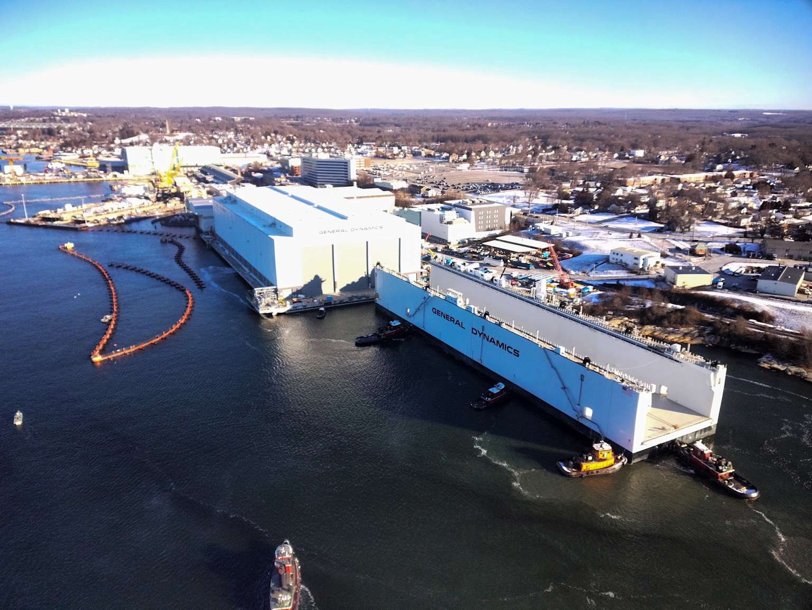
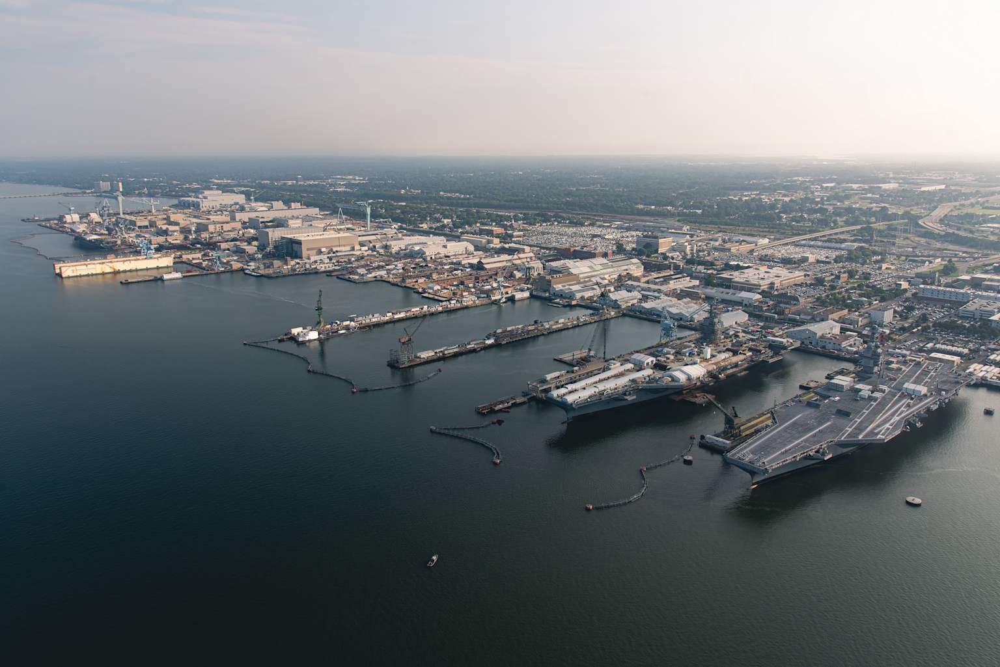
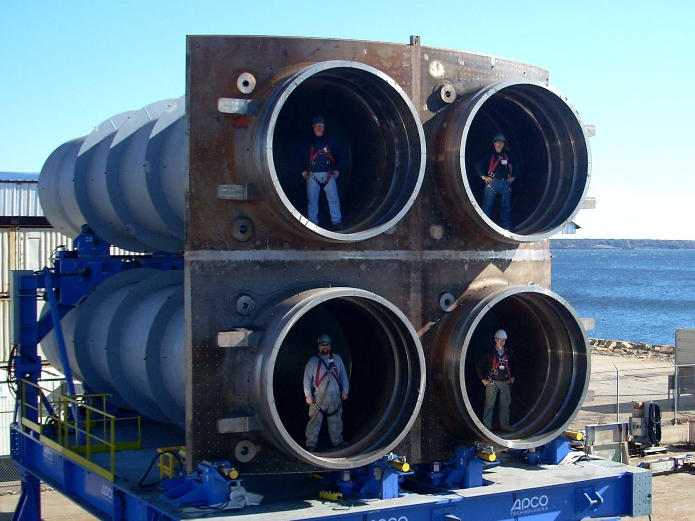

# Basic Construction

**Basic Construction/Conversion** — the line item the Navy's Exhibit P-5c Ship Cost Analysis labels as such — is the central analytical denominator of this article. It is the dollar value of the prime construction contract the Navy awards to General Dynamics Electric Boat under each fiscal-year SCN procurement. Within it, GDEB self-performs some of the work (labor and overhead at its Groton, Connecticut hull-construction facility and its Quonset Point, Rhode Island module fabrication facility), pays Huntington Ingalls Newport News Shipbuilding under the teaming arrangement to deliver its workshare, and subcontracts the remainder to the broader supplier base. The "outsourced share" question that the rest of this article addresses is properly phrased as the share *of Basic Construction* that flows to firms other than GDEB.

This chapter documents what Basic Construction is, how it scales across classes and fiscal years, and where it sits relative to the other cost-category layers of the Total Ship Estimate. It does not attempt to decompose Basic Construction into sub-categories the budget documents do not publish; instead, it characterizes the work content using the assembling shipyards' own public descriptions of the physical construction process.

## What Basic Construction is

<figure class="float-right"><figcaption>General Dynamics Electric Boat's Groton, Connecticut waterfront. The "Atlas" floating dry dock — delivered to support Columbia-class construction — is visible at the head of the yard.</figcaption></figure>

<figure class="float-right"><figcaption>Huntington Ingalls Newport News Shipbuilding waterfront, Newport News, Virginia. NNS delivers approximately six module sections per Columbia hull and approximately half of Virginia construction work under the GDEB-NNS teaming arrangement.</figcaption></figure>

Basic Construction is the prime construction contract base — the dollars the Navy obligates against the SCN line-item PIID for the assembly of the hull. For Virginia and Columbia, the prime is GDEB under PIIDs `N0002417C2100` (Virginia Block V/VI master) and `N0002417C2117` (Columbia Build I/II master), among others.[^repo-scope] Inside this dollar figure are:

- **Hull structural fabrication** — pressure hull rolled and welded steel sections, framing, decks, bulkheads, and the structural integration of major module sections.
- **Outfitting** — installation of piping systems, electrical distribution, ventilation, hydraulic and compressed-air systems, foundations, fittings, and equipment installations.
- **Auxiliary machinery installation** — installation of pumps, valves, switchgear, and miscellaneous mechanical and electrical equipment (whether sourced as GDEB-purchased CFE or as government-furnished).
- **Module integration** — assembly of the hull from major module sections. For Columbia, this includes the Newport News-built bow, stern, auxiliary machinery room, superstructure, missile compartment, and weapons modules; for Virginia, the equivalent module construction at Quonset Point and Newport News.[^hii-columbia-modules]
- **Painting, testing, and final assembly** — coating, hydrostatic and operational testing of installed systems, and shipyard-side integration and sea trials.
- **Program management and overhead** — GDEB program-office labor, facility overhead, supplier-management cost, and similar burdened costs allocable to the construction contract.

Items procured as GFE — the naval reactor plant, combat systems hardware and software, Trident strategic weapon system for Columbia, sonar and electronic-warfare integration — are *not* in Basic Construction; they appear on the separate Propulsion Equipment, Electronics, Hull-Mechanical-Electrical, and Ordnance lines of Exhibit P-5c covered in [Plans, GFE, and other layers](03-plans-gfe-and-other-layers.md). Plans Costs are similarly separate.

## Per-class per-fiscal-year Basic Construction

The table presents Basic Construction in nominal millions of then-year dollars, alongside Total Ship Estimate and the Basic Construction share. Per-fiscal-year values are drawn from the most recent Justification Book showing the fiscal year as a settled actual.[^scn-fy27pb][^scn-fy22-fy26-pb]

### Columbia (Line Item 1045)

| FY | Hull | Basic Constr. $M | Total Ship Est. $M | BC % of Total |
|---:|:--|---:|---:|---:|
| 2021 | SSBN-826 | 5,979.4 | 16,121.6 | 37.1% |
| 2024 | SSBN-827 | 6,356.1 | 10,688.8 | 59.5% |
| 2026 | SSBN-828 | 7,159.8 | 10,744.3 | 66.6% |
| 2027 | SSBN-829 | 6,853.7 | 10,486.4 | 65.4% |

The Columbia lead boat (SSBN-826) has the lowest Basic Construction share (37.1 percent) because the Plans Costs absorb $6,946 million of the Total Ship Estimate — the lead-boat convention loading non-recurring engineering onto the first hull. The follow-on boats settle into a roughly 60-to-67-percent Basic Construction share as Plans Costs decline.

### Virginia (Line Item 2013)

| FY | Hulls | Basic Constr. $M | Total Ship Est. $M | BC % of Total |
|---:|:--|---:|---:|---:|
| 2022 | 2 | 4,758.3 | 6,915.8 | 68.8% |
| 2023 | 2 | 5,095.4 | 7,250.6 | 70.3% |
| 2024 | 2 | 9,070.8 | 11,377.6 | 79.7% |
| 2025 | 1 | 5,326.5 | 9,500.5 | 56.1% |
| 2026 | 1 | 3,136.8 | 5,389.1 | 58.2% |
| 2027 | 2 | 8,889.3 | 11,437.0 | 77.7% |

Virginia's Basic Construction share runs higher than Columbia's because Virginia is past lead-boat status and the Plans Cost loading is modest. Per-fiscal-year Basic Construction is approximately $4.8-5.1 billion for two-boat Block V years and approximately $8.9-9.1 billion for two-boat Block VI years; single-boat FY2025 and FY2026 show smaller Basic Construction with elevated Plans Cost in FY2025 (Block VI engineering recognized).

## Cumulative Basic Construction across the window

For sizing the addressable supplier opportunity, the cumulative Basic Construction across the article's principal coverage window — fiscal years 2022 through 2027 — is approximately:

| Class | Years included | Cumulative Basic Construction |
|---|:--|---:|
| Virginia | FY22 + FY23 + FY24 + FY25 + FY26 + FY27 | $36,277M |
| Columbia | FY24 + FY26 + FY27 (procurement years) | $20,370M |
| **Combined** | — | **$56,647M** |

The Virginia cumulative is across six fiscal years of two-boat-equivalent procurement; the Columbia cumulative is across three procurement years (the AP-only years FY2022, FY2023, and FY2025 contribute no Basic Construction). On a per-fiscal-year basis the combined Basic Construction is approximately **$8 to $11 billion per year** during the article's coverage period, depending on which class is procuring in a given year.

## Yard self-performed versus outsourced

Basic Construction is *not* equivalent to "what GDEB does in its own facilities." Basic Construction is the prime contract base — the dollars the Navy pays GDEB — and GDEB then distributes those dollars across:

1. **GDEB self-performed labor and overhead** at Groton and Quonset Point.
2. **HII Newport News Shipbuilding workshare** under the teaming arrangement. The publicly described split is approximately half of Virginia construction and approximately a fifth of Columbia construction by workload share.[^repo-scope]
3. **Purchased material booked as direct material cost** — major and minor components procured by GDEB from outside vendors and installed in the hull.
4. **First-tier subcontracts to outside firms** for fabrication, services, or specialty work. The subset above the FFATA reporting threshold appears in the FFATA Subaward Reporting System (FSRS); the subset below the threshold, plus indirect items and certain long-term agreements, do not.[^far-52-204-10]
5. **Lower-tier subcontracts** beneath the first tier, which are not reportable to FSRS.

The dollar split among these five categories is the core of the outsourcing question. None of the five is reported directly by Navy or shipbuilder in a way that produces a clean make-or-buy ratio for the Basic Construction line. The article approaches the split through the combination of evidence in chapters 6 through 12: the cost-funnel framework (chapter 6), the direct DoD contract-announcement measurement (chapter 7), the FFATA-visible first-tier subaward data (chapters 8 and 9), the Maritime Industrial Base layer (chapter 10), the HII Newport News visibility gap (chapter 11), and the unseen layer of purchased material and lower-tier subcontracts (chapter 12).

The Government Accountability Office has confirmed the central directional finding that informs this article's analytical posture: "Two of the shipbuilders we spoke with are already outsourcing work that would normally be done at their shipyards to their suppliers to overcome constrained physical space, with plans to expand the volume of material they are outsourcing."[^gao-25-106286] The shipbuilders are HII and GDEB; both are operating at constrained shipyard capacity and have stated, through official channels, that they are expanding the share of work flowing to outside suppliers.

## Module-section construction at the team partner

<figure class="float-right"><figcaption>A Common Missile Compartment quad-pack assembly. The CMC houses four missile launch tubes and is shared between the U.S. Columbia and U.K. Dreadnought programs.</figcaption></figure>

The most concrete public description of work performed outside the GDEB hull-construction yards within Basic Construction is HII's own description of its Columbia role. HII Newport News Shipbuilding publicly describes itself as constructing and delivering approximately **six module sections per Columbia submarine** under contract to GDEB, including bow, stern, auxiliary machinery room, superstructure, missile compartment, and weapons modules.[^hii-columbia-modules] These module sections are delivered from Newport News, Virginia to Groton, Connecticut for hull integration. The dollars associated with the HII workshare are inside GDEB's Basic Construction line — they are part of what GDEB receives from the Navy on the prime contract — but the work itself is performed at a different private shipyard.

For Virginia, the corresponding HII role is approximately half of the construction workload, with module fabrication at Newport News and at GDEB's Quonset Point, Rhode Island facility. The Virginia teaming split is documented in General Dynamics Corporation's Form 10-K filings: "[The Marine Systems segment has one primary competitor] with which it also partners on the Virginia-class submarine program, and to which it subcontracts on the Columbia-class submarine program."[^gd-10k-fy21]

This article does not include the HII workshare in "outsourced" calculations of denominator (1) — outsourced from GDEB — because GDEB does pay HII through the prime, but the workshare *is* outsourced in denominators (2), (3), and (4). [The HII Newport News visibility gap](11-hii-newport-news-gap.md) quantifies how much of the implied HII submarine workshare is invisible to the FFATA first-tier subaward stream.

## Where this leaves the funnel

After this chapter, the cost funnel is positioned at the Basic Construction line for each class and each fiscal year. The cumulative Basic Construction across the FY2022-FY2027 window is approximately $56.6 billion. Per-fiscal-year Basic Construction is approximately $8 to $11 billion combined across the two classes.

The next chapter pulls back one step to examine the Advance Procurement layer — the long-lead-time material and economic order quantity purchases that the shipbuilder makes one or two fiscal years *before* the construction year, which the budget documents report on Exhibit P-10. AP is part of the same per-class per-fiscal-year procurement story (it is loaded onto specific construction years via the P-40 "Less Prior Year AP" and "Plus Current Year AP" lines), and it is the most concrete window the public budget documents provide into what the shipbuilder actually buys before bending steel.

After the AP detail, [The outsourced layer within Basic Construction](06-outsourced-band-within-bc.md) addresses the central question: how much of Basic Construction is purchased from outside firms versus self-performed by the assembling yard.

[^scn-fy27pb]: U.S. Department of the Navy, Fiscal Year 2027 President's Budget, *Shipbuilding and Conversion, Navy* (SCN) Justification Book, April 2026. Exhibit P-5c Ship Cost Analysis for Line Item 1045 (Columbia) and Line Item 2013 (Virginia). <https://www.secnav.navy.mil/fmc/fmb/Pages/Fiscal-Year-2027.aspx>.

[^scn-fy22-fy26-pb]: U.S. Department of the Navy, *Shipbuilding and Conversion, Navy* Justification Books accompanying the FY2022 through FY2026 President's Budgets. Used for multi-vintage reconciliation of per-fiscal-year Basic Construction values.

[^repo-scope]: For the inventory of in-scope new-construction PIIDs and the publicly described workload split between GDEB and HII-NNS, see [Scope and the funnel framework](01-scope-and-funnel-framework.md). The Virginia ~50% / Columbia ~22% HII workshare is described in industry coverage and in HII's own product literature.

[^hii-columbia-modules]: Huntington Ingalls Industries, Newport News Shipbuilding division, "Columbia-Class (SSBN)" product page. Public corporate description of Newport News Shipbuilding's role constructing approximately six module sections per Columbia-class submarine under subcontract to General Dynamics Electric Boat. <https://www.hii.com/products/columbia-class>.

[^gd-10k-fy21]: General Dynamics Corporation, Annual Report on Form 10-K for fiscal year 2021. SEC accession 0000040533-22-000007. Available via SEC EDGAR at <https://www.sec.gov/cgi-bin/browse-edgar?action=getcompany&CIK=0000040533>.

[^far-52-204-10]: 48 C.F.R. § 52.204-10, "Reporting Executive Compensation and First-Tier Subcontract Awards." Federal Acquisition Regulation contract clause implementing FFATA reporting; $30,000 per-action threshold. <https://www.acquisition.gov/far/52.204-10>.

[^gao-25-106286]: U.S. Government Accountability Office, *Shipbuilding and Repair: Navy Needs a Strategic Approach for Private Sector Industrial Base Investments*, GAO-25-106286, February 27, 2025. "Two of the shipbuilders we spoke with are already outsourcing work that would normally be done at their shipyards to their suppliers to overcome constrained physical space, with plans to expand the volume of material they are outsourcing." <https://www.gao.gov/products/gao-25-106286>.
