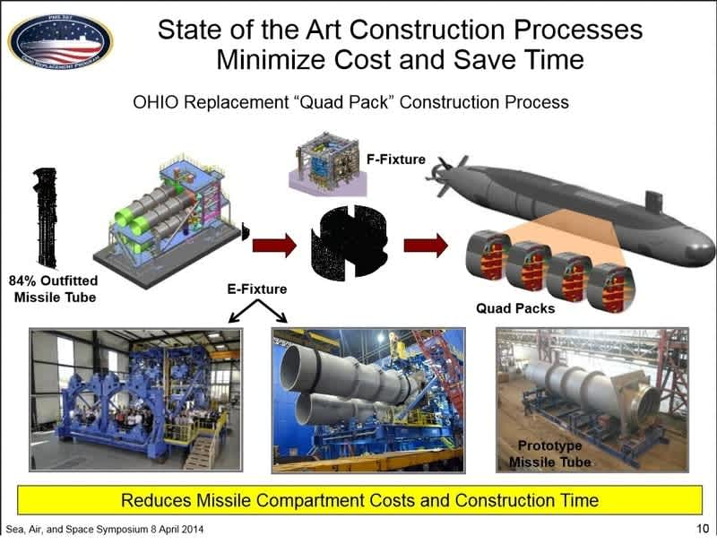
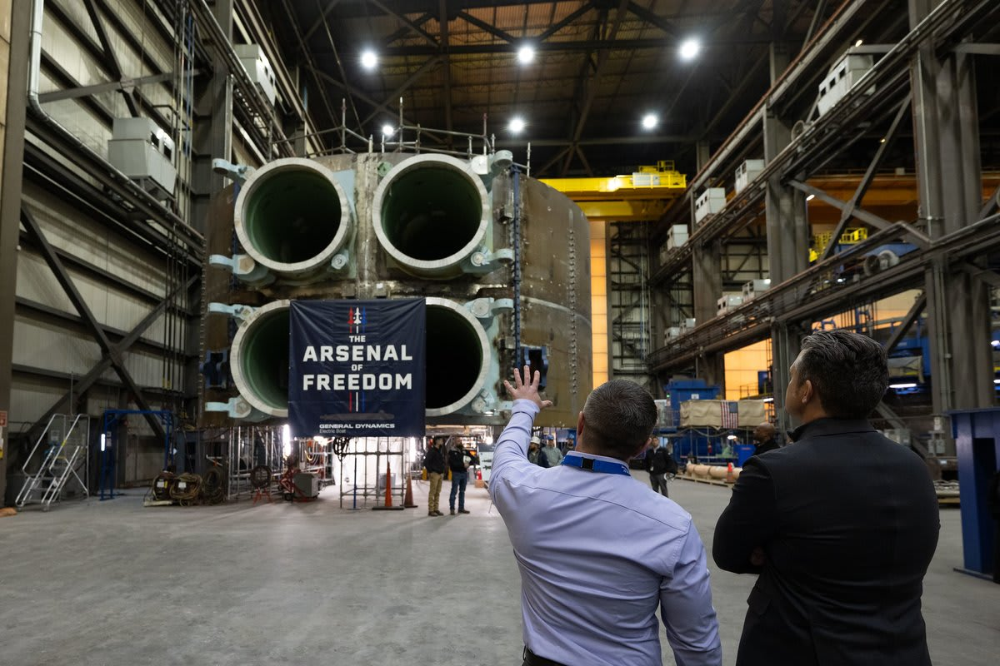

# Navy and OSD industrial-base policy

This chapter documents the U.S. Department of the Navy and broader Office of the Secretary of Defense policy framework that, over the period from approximately 2018 through May 2026, has established the **submarine industrial-base expansion** as a formal Navy and Department of Defense priority. The most consequential single policy statement in the window is the May 2026 release of the FY2027 30-Year Shipbuilding Plan — colloquially "the Golden Fleet plan" — which formally commits to increasing the share of Navy shipbuilding performed at "distributed sites" from approximately 10 percent today to approximately 50 percent. The plan is accompanied by approximately $10 billion in cumulative Department of Defense investment in the submarine industrial base, the establishment of a dedicated Maritime Industrial Base Program Office in September 2024, the Reconciliation legislation's $30-billion-plus shipbuilding funds, and the AUKUS Pillar 1 framework's $3-billion Australian contribution to the U.S. submarine industrial base.

The chapter sets out the policy timeline, the principal documents and statements, and the institutional structures that the Navy has built to execute the industrial-base expansion. The policy framework is consequential for this article's outsourcing-trajectory framework because it formally aligns the Navy's strategic direction with the operational direction the shipbuilders are taking on the corporate side (see [Executive commentary](13-executive-commentary.md)).

## The "Golden Fleet" FY2027 30-Year Shipbuilding Plan

In April 2026, the U.S. Department of the Navy released the FY2027 30-Year Shipbuilding Plan as part of the FY2027 President's Budget submission. The plan, popularly called the "Golden Fleet" plan in trade-press coverage, articulates a 30-year procurement profile by ship class through fiscal year 2056 and a series of industrial-base strategic commitments.[^navy-fy27-plan][^navy-fy27-press]

The single most consequential statement in the plan for this article's purposes is the **distributed-shipbuilding target**:

> "Currently only 10% of shipbuilding occurs at distributed sites. The Navy aims to increase this to 50% to enhance flexibility, reduce legacy shipyard dependency, and accelerate delivery timelines."

The 10-percent-to-50-percent target is a fivefold expansion of the share of Navy shipbuilding performed outside the established prime shipyards. The target is for all Navy shipbuilding rather than submarine-specific — the Navy has not separately published a sub-specific number underneath it — but the policy direction is unambiguous. The Navy is officially committing to a structural shift in *where* shipbuilding work happens.

The plan separately opens the door to overseas content as a backstop:

> "While American shipbuilding remains the priority, the Navy will evaluate overseas options and whether allied and partner shipbuilding can supplement domestic production if U.S. industry cannot meet required timelines."

The "evaluate overseas options" language has consequential implications for the foreign-vendor share of the U.S. submarine supplier base. The current foreign share is approximately 3 percent of FFATA-visible flow (chapter 9), concentrated in United Kingdom partners on Columbia (Babcock Marine Rosyth, Rolls-Royce UK) and Switzerland (APCO Technologies Common Missile Compartment launch tubes). The Navy's formal openness to allied and partner shipbuilding implies that this share could grow as the AUKUS Pillar 1 framework matures and the U.S. supplier base reaches its capacity limits.

The plan also allocates **approximately $6.2 billion specifically to expand and stabilize the submarine industrial base** through workforce development, supplier expansion, distributed shipbuilding, advanced manufacturing technologies, and productivity modernization programs.[^navy-golden-fleet]

The FY2027 shipbuilding budget request that accompanied the plan was approximately $65.8 billion — the largest single-year request in Navy shipbuilding history.[^gao-26-109068]

## The cumulative Department of Defense submarine industrial-base investment

The Government Accountability Office's April 2026 testimony provides the most recent authoritative figure for cumulative Department of Defense investment in the submarine industrial base:[^gao-26-109068]

> "DOD does not know how much funding it expects to need — beyond the more than $10 billion DOD already invested — to solve submarine industrial base challenges."

The $10-billion-plus figure consolidates the running total across approximately a decade of submarine industrial-base appropriations and supplements. The Congressional Research Service provides additional structural detail. Per the January 2026 Virginia-class report:[^crs-rl32418]

> "The estimated total amount of funding appropriated through FY2024, requested for FY2025, and programmed for FY2026-FY2028 for the submarine construction industrial base is about $9.8 billion."

The $9.8-billion figure as of the FY2024 budget submission, supplemented by subsequent appropriations (the One Big Beautiful Bill Act of 2025 added over $30 billion to Navy and Coast Guard shipbuilding collectively;[^gao-26-109068] additional reconciliation- and appropriation-level supplements have followed), brings the running total to the $10-billion-plus figure GAO documents.

The broader Department of Defense shipbuilding-industrial-base spending is documented separately by GAO-25-106286 at approximately **$5.8 billion across fiscal years 2014 through 2023**, with **$12.6 billion of additional planned spending through fiscal year 2028**.[^gao-25-106286] The sub-specific portion of this broader shipbuilding figure is approximately the $9.8-to-10-billion-plus figure noted above.

## The Maritime Industrial Base Program Office

In June 2024, the Navy released a memorandum directing the establishment of a Maritime Industrial Base Program Office. The office began operating in September 2024. Per GAO-25-106286:[^gao-25-106286]

> "The Navy released a memorandum in June 2024... directed the establishment of a Maritime Industrial Base Program Office... began operating in September 2024."

The MIB Program Office is the institutional structure through which the Navy directs the cumulative $10-billion-plus submarine industrial-base investment and through which the BlueForge Alliance and similar consortium-based supplier-development funding is administered. GAO characterizes BlueForge Alliance in the same report as a "nonprofit integrator [that] has supported the use of submarine supplier development funding for the shipbuilders." The MIB Program Office's establishment formalizes the Navy's oversight of an investment program that had previously been distributed across multiple program offices and budget lines.

## AUKUS Pillar 1 and Australia's contribution to the U.S. submarine industrial base

<figure class="float-right"><figcaption>NAVSEA process diagram of the Common Missile Compartment quad-pack architecture, shared between the U.S. Columbia and U.K. Dreadnought programs.</figcaption></figure>

The AUKUS Pillar 1 framework — the trilateral agreement among Australia, the United Kingdom, and the United States announced in 2021 and operationalized through the 2024-2025 budget cycles — has direct industrial-base implications for U.S. submarine production. Per CRS RL32418:[^crs-rl32418]

> "Australia is to invest at least $3 billion in its own industrial base to establish an Australian capacity for building and maintaining SSNs. In addition to that $3 billion... Australia is to make a $3 billion contribution to the U.S. submarine industrial base."

The $3-billion Australian contribution to the U.S. submarine industrial base is a foreign-government appropriation flowing into U.S. supplier-base capacity-expansion programs. The Australian contribution is one of the components funding the U.S. industrial-base ramp documented elsewhere in this chapter.

The Pillar 1 framework also envisions an increased U.S. Virginia-class production rate to support the U.S. Navy's own requirement plus the planned sale of three to five Virginia hulls to Australia:[^crs-rl32418]

> "Increasing the Virginia-class production rate to 2.0 boats per year, and subsequently to 2.33 boats per year, the rate the Navy states will be needed to not only execute the two-per-year procurement rate, but also build replacement SSNs for the three to five Virginia-class boats that are to be sold to Australia."

The Virginia-class production rate is currently below the two-per-year target. The CRS report and trade-press coverage have documented that "where we should be delivering two Virginia-class submarines a year, we are currently only on pace to deliver 1.3."[^breaking-defense-raven] The 2.33-per-year target reflects the U.S.-plus-AUKUS aggregate demand requirement.

The implication of AUKUS Pillar 1 for the article's outsourcing trajectory is that the demand for U.S. submarine supplier-base capacity is structurally larger than the U.S. Navy's own requirement alone — and the Navy's policy direction to expand distributed shipbuilding is reinforced by the AUKUS demand.

## America's Maritime Action Plan

In February 2026, the White House released America's Maritime Action Plan — a cross-government framework addressing the common challenges of U.S. shipbuilding (commercial and government).[^gao-26-109068]

> "America's Maritime Action Plan by the White House in February 2026. This plan sets out the common challenges faced by the maritime industrial base across government and commercial shipbuilding."

The Maritime Action Plan is broader than the Navy's Golden Fleet plan; it covers commercial as well as defense shipbuilding and is administered at the White House level rather than at Department of the Navy level. For the submarine industrial base specifically, the Maritime Action Plan informs the broader policy environment but is operationalized through the Navy's MIB Program Office and the supporting budgetary structures.

## Government Accountability Office oversight findings

The U.S. Government Accountability Office has published a series of reports characterizing the Navy's submarine industrial-base policy and identifying oversight gaps. Three findings are particularly consequential:

1. **GAO-21-257 (January 2021):** The submarine supplier base is "roughly 70 percent smaller than in previous shipbuilding booms." This finding is the foundational characterization of the supplier-base atrophy that subsequent industrial-base investment is intended to reverse.[^gao-21-257]

2. **GAO-24-107732 (September 2024):** The Supervisor of Shipbuilding (SUPSHIP) Groton and Newport News organizations are "not well positioned to conduct quality-assurance oversight for the significant amount of Columbia work being outsourced." This is a direct GAO statement that work is being outsourced and that Navy oversight has not kept pace.[^gao-24-107732]

3. **GAO-25-106286 (February 2025):** "Two of the shipbuilders we spoke with are already outsourcing work that would normally be done at their shipyards to their suppliers to overcome constrained physical space, with plans to expand the volume of material they are outsourcing." This is the GAO's most direct primary-source statement that the outsourcing expansion is current and forward-looking operational practice.[^gao-25-106286]

GAO has also documented schedule and performance issues — the 17-month delay on the lead Columbia, the 96-month-vs-84-month tracking, the Northrop Grumman turbine-generator-as-late-supplier finding — that motivate the industrial-base investment urgency.

## The Ohio-Columbia strategic-deterrence forcing function

<figure class="float-right"><figcaption>Aft view of a Columbia missile compartment showing the four launch-tube openings. The Common Missile Compartment is shared with the U.K. Dreadnought program.</figcaption></figure>

A specific forcing function distinguishes the Columbia program from other Navy shipbuilding: the Ohio-class ballistic-missile submarine begins retiring in calendar year 2027, and the lead Columbia must be ready for first patrol in fiscal year 2031 to avoid a gap in the strategic-deterrence requirement. Per GAO-24-107732:[^gao-24-107732]

> "As Ohio class submarines begin to retire in 2027, the lead Columbia class submarine must be ready for its first patrol in fiscal year 2031 to avoid a gap in deterrence requirements."

The strategic-deterrence forcing function is the operational reason the Columbia program is the highest-priority shipbuilding effort in the Navy's portfolio, and is the structural reason the Maritime Industrial Base investment is concentrated on the Columbia line.

## Policy alignment with shipbuilder strategy

The Navy and OSD policy framework documented in this chapter operates in the same direction as the shipbuilder corporate strategies documented in [Executive commentary](13-executive-commentary.md). The alignment is most explicit between the Navy's "distributed shipbuilding" terminology and HII's "distributed shipbuilding strategy" terminology — Kastner's adoption of this language in the May 2026 fiscal year 2026 first-quarter earnings call is essentially a corporate-level adoption of the Navy's strategic vocabulary.[^hii-fy26q1]

The convergence of policy and operational strategy means the article's outsourcing-trajectory framework is supported on three independent axes: (1) the cost-funnel and supporting evidence (chapter 6); (2) the direct primary-source measurement from DoD daily-announcement data (chapter 7); (3) and now the policy-and-operational-strategy alignment documented in chapters 13 and 14. The three axes do not depend on each other for validity; their concurrence is independent evidence that the structural shift in submarine outsourcing is real and is operationally executed.

## Cross-references

- For the cost-funnel framework that policy supports: [The outsourced layer within Basic Construction](06-outsourced-band-within-bc.md).
- For the direct primary-source measurement of policy direction: [DoD contract announcement data](07-dod-contract-announcement-data.md).
- For shipbuilder corporate-strategy alignment with policy direction: [Executive commentary](13-executive-commentary.md).
- For the Maritime Industrial Base layer in financial detail: [The Maritime Industrial Base layer](10-maritime-industrial-base.md).
- For prime financial trajectories supporting the policy framework: [Prime financials](15-prime-financials.md).

[^navy-fy27-plan]: U.S. Department of the Navy, Fiscal Year 2027 President's Budget, *30-Year Shipbuilding Plan* ("Golden Fleet" plan), April 2026. <https://www.secnav.navy.mil/fmc/fmb/>.

[^navy-fy27-press]: U.S. Department of the Navy, "Department of the Navy Releases Fiscal Year 2027 Shipbuilding Plan," press release. <https://www.navy.mil/Press-Office/Press-Releases/display-pressreleases/Article/4483211/department-of-the-navy-releases-fiscal-year-2027-shipbuilding-plan/>.

[^navy-golden-fleet]: Trade-press coverage of the Navy's FY2027 30-Year Shipbuilding Plan, including the $6.2 billion submarine-industrial-base allocation, in *Navy Times*, *Army Recognition*, and *Defense Post*, May 12–13, 2026.

[^gao-26-109068]: U.S. Government Accountability Office, Shelby S. Oakley, *Navy and Coast Guard Shipbuilding: A Disciplined Strategy-Driven Approach Is Needed* (testimony), GAO-26-109068, April 22, 2026. "DOD does not know how much funding it expects to need — beyond the more than $10 billion DOD already invested — to solve submarine industrial base challenges." Documents the FY2027 $65-billion-plus shipbuilding request and the One Big Beautiful Bill Act (Pub. L. 119-21) $30-billion-plus collective Navy / Coast Guard appropriation. <https://www.gao.gov/products/gao-26-109068>.

[^crs-rl32418]: Congressional Research Service, *Navy Virginia (SSN-774) Class Attack Submarine Program and AUKUS Submarine (Pillar 1) Project: Background and Issues for Congress* (RL32418), Ronald O'Rourke, January 26, 2026. <https://www.congress.gov/crs-product/RL32418>.

[^gao-25-106286]: U.S. Government Accountability Office, *Shipbuilding and Repair: Navy Needs a Strategic Approach for Private Sector Industrial Base Investments*, GAO-25-106286, February 27, 2025. Documents the $5.8 billion DoD shipbuilding-IB spending FY2014-FY2023, $12.6 billion planned through FY2028, the Maritime Industrial Base Program Office establishment, BlueForge Alliance's nonprofit-integrator role, and the "two shipbuilders are already outsourcing" finding. <https://www.gao.gov/products/gao-25-106286>.

[^gao-21-257]: U.S. Government Accountability Office, *Columbia Class Submarine: Delivery Hinges on Timely and Quality Materials from an Atrophied Supplier Base*, GAO-21-257, January 14, 2021. The "roughly 70 percent smaller than in previous shipbuilding booms" figure. <https://www.gao.gov/products/gao-21-257>.

[^gao-24-107732]: U.S. Government Accountability Office, *Columbia Class Submarine: Overcoming Persistent Challenges Requires Yet Undemonstrated Performance and Better-Informed Supplier Investments*, GAO-24-107732, September 30, 2024. SUPSHIP oversight finding; the FY2031 Ohio-Columbia deterrence-gap forcing function. <https://www.gao.gov/products/gao-24-107732>.

[^breaking-defense-raven]: Erik Raven, "Invest in the US industrial base to support our Navy and AUKUS," *Breaking Defense* op-ed, April 2024. "Where we should be delivering two Virginia-class submarines a year, we are currently only on pace to deliver 1.3." <https://breakingdefense.com/2024/04/invest-in-the-us-industrial-base-to-support-our-navy-and-aukus-raven/>.

[^hii-fy26q1]: Huntington Ingalls Industries, fiscal year 2026 first-quarter earnings release and conference call, May 5, 2026. Chris Kastner, Chief Executive Officer: "Leveraging our distributed shipbuilding strategy..."
